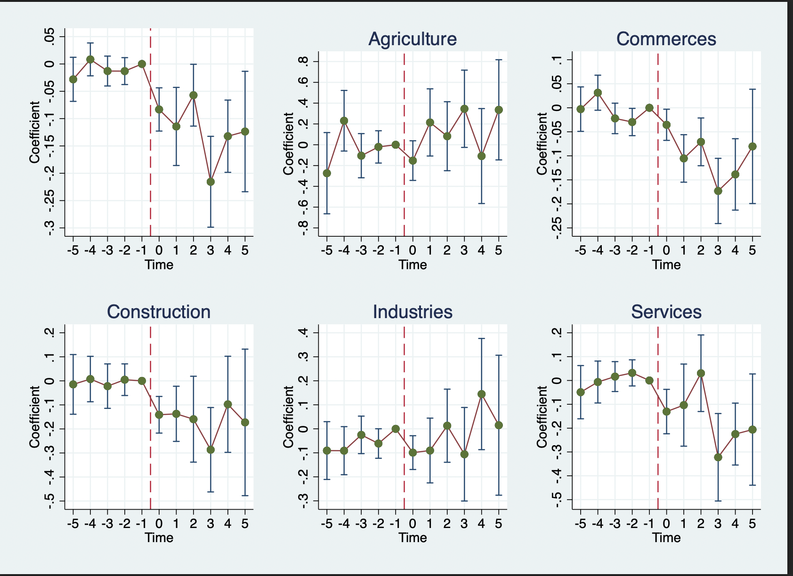

# After the Flood — The Impact of Flooding on Employment and Wages in French Firms

M2 thesis, Paris School of Economics (2025) · Andrea Salem
Supervisors: François Fontaine, Sara Signorelli · Referee: Hélène Ollivier

**📄 Paper:** [`paper/Salem_2025_The_Impact_of_Flooding_on_Employment_and_Wages.pdf`](paper/Salem_2025_The_Impact_of_Flooding_on_Employment_and_Wages.pdf)
**🌐 Website:** *coming soon*

## Abstract

Rising tail risks from extreme weather events elevate flood risk to the forefront of France's
climate governance debates. This paper quantifies the causal impact of extreme floods on labor
markets and firm dynamics. Leveraging matched employer–employee data on all French establishments
(2010–2019) and ministerial disaster declarations under the French CatNat insurance regime, I
implement a Local Projection Difference-in-Differences design to address staggered treatment and
dynamic responses. Flood shocks reduce employment by roughly 2% and wages by 1% on average in
establishments affected by extreme flooding over the five years following a disaster, with losses
concentrated in commerce, construction, and local services, and among small, undiversified firms.
Industrial and agricultural establishments exhibit resilience. Commune-level results are more
muted, consistent with aggregate recovery dynamics, insurance transfers, and spatial reallocation
of economic activity.

**Keywords:** Firm performance, Wages, Natural disasters · **JEL:** D22, Q54, R11

<p align="center">
  <br>
  <em>Employment response of establishments hit by an extreme flood (LP-DiD event study).</em>
</p>

## Repository structure

```
├── paper/
│   ├── Salem_2025_….pdf          # the thesis, as submitted (August 2025)
│   ├── src/                      # full LaTeX source — frozen; see paper/ERRATA.md
│   └── ERRATA.md                 # build verification + known source quirks
├── code/
│   ├── casd_export_2025-07/      # the exact code that produced the results (frozen, provenance)
│   └── pipeline/                 # clean R rewrite — public-data stages runnable end-to-end
├── data/                         # no data committed; sources + vintages in data/README.md
└── output/tables/                # disclosure-cleared regression output from the enclave
```

The two code tracks have different guarantees — provenance vs. reproducibility — explained in
[`code/README.md`](code/README.md).

## Data availability

The microdata are **confidential** and accessed through [CASD](https://www.casd.eu/) (Centre
d'accès sécurisé aux données). No microdata are or ever will be in this repository.

| Source | Content | Access |
|---|---|---|
| DADS Postes (INSEE) | Matched employer–employee panel, all French establishments | CASD |
| FARE / FICUS (INSEE–DGFiP) | Firm financial statements | CASD |
| GASPAR (Géorisques) | CatNat ministerial disaster declarations | Public |
| JRC flood hazard maps (Dottori et al.), TRI, ONRN EAIP | Flood depth rasters and flood-prone areas | Public |

Full manifest with files, vintages, and download sources: [`data/README.md`](data/README.md).

## Reproducibility, honestly stated

| Claim | Status |
|---|---|
| The LaTeX source reproduces the submitted PDF | ✅ Verified — 52/52 pages, word-for-word identical text ([details](paper/ERRATA.md)) |
| `code/casd_export_2025-07/` is the code that produced the thesis numbers | ✅ CASD export of 2025-07-09, byte-frozen ([provenance](code/casd_export_2025-07/README.md)) |
| Flood-treatment and exposure construction re-runs on public data | 🔄 In progress — `code/pipeline/`, outputs diffed against thesis figures |
| Rewritten confidential-data pipeline matches the enclave results | ⏳ Owed to the next CASD session; until then the rewrite is labeled unverified |

Environment details (R and Stata package surface): [`code/casd_export_2025-07/ENVIRONMENT.md`](code/casd_export_2025-07/ENVIRONMENT.md).

## Citation

```bibtex
@mastersthesis{salem2025flood,
  author = {Salem, Andrea},
  title  = {After the Flood: The Impact of Flooding on Employment and Wages in French Firms},
  school = {Paris School of Economics},
  year   = {2025},
  type   = {M2 Master's thesis},
  note   = {Master Public Policy and Development}
}
```

## Related work

This thesis feeds the flood-risk pillar of my PhD research agenda (CASD-based follow-ups on
adaptation, insurance regimes, and belief formation after disasters).

## License

Code is MIT-licensed; the manuscript text and figures are © the author (see [`LICENSE`](LICENSE)).
