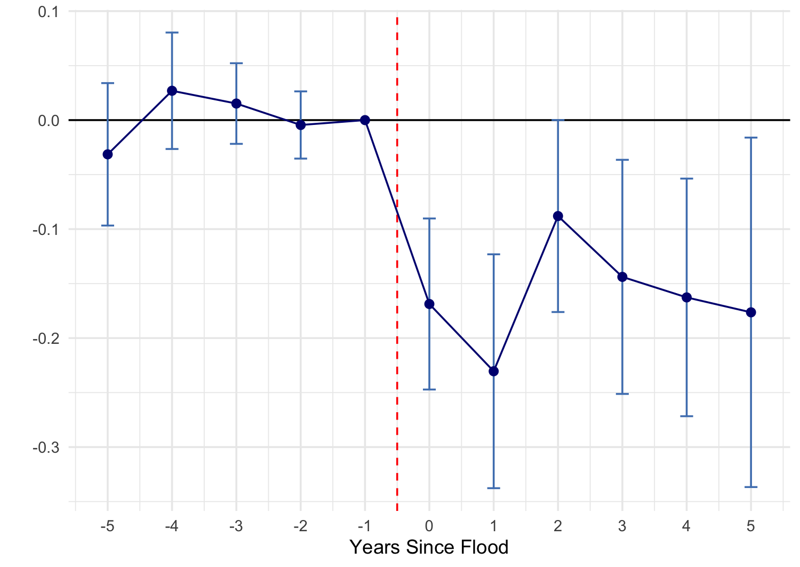

::: {.hero}
# After the Flood

[The Impact of Flooding on Employment and Wages in French Firms]{.subtitle}

[Andrea Salem · M2 Master Thesis · Paris School of Economics · 2025 
Supervisors: François Fontaine & Sara Signorelli · Referee: Hélène Ollivier]{.meta}

::: {.btns}
[Read the paper](paper.qmd){.btn .btn-light-outline}
[Download PDF](Salem_2025_The_Impact_of_Flooding_on_Employment_and_Wages.pdf){.btn .btn-light-outline}
[Code & data](data-code.qmd){.btn .btn-light-outline}
:::
:::

::: {.column-body}

## In one paragraph

Floods are France's most consequential natural hazard, and climate change is making their
tail risks fatter. Using matched employer–employee data on **all French establishments
(2010–2019)** and ministerial disaster declarations under the *CatNat* insurance regime, this
paper estimates the causal effect of extreme floods on labor markets and firm dynamics with a
**Local Projection Difference-in-Differences** design. Establishments hit by an extreme flood
lose employment and wages persistently over the following five years — but commune-level
aggregates barely move, revealing how insurance, reallocation, and recovery dynamics absorb
local shocks.

::: {.findings}
::: {.finding}
[−2%]{.num} [employment in flooded establishments over the five years after a flood]{.lbl}
:::
::: {.finding}
[−1%]{.num} [end-of-year wages, with hourly wages — a productivity proxy — largely unchanged]{.lbl}
:::
::: {.finding}
[Commerce & construction]{.num} [bear the brunt; industry and agriculture are resilient]{.lbl}
:::
::: {.finding}
[Muted aggregates]{.num} [commune-level effects are flat: insurance and reallocation buffer the shock]{.lbl}
:::
:::

{width="88%"}

## Why it matters

Reduced-form estimates like these discipline structural models of climate damages — the
damage functions behind forward-looking adaptation policy. The heterogeneity documented here
(small, undiversified, mono-establishment firms in commerce, construction, and local services
are the most vulnerable) tells firms, insurers, and governments *where* proactive adaptation
is most valuable — and shows that flat aggregate statistics can hide large, persistent losses
for the least mobile workers and least diversified firms.

## Read more

- **[The full paper, as a web page →](paper.qmd)** — all sections, figures, and tables
- **[Data & code →](data-code.qmd)** — sources, access, and the replication repository
- **[Submitted PDF →](Salem_2025_The_Impact_of_Flooding_on_Employment_and_Wages.pdf)**

:::
