::: {.callout-note appearance="simple"}
This is the web version of the thesis submitted in August 2025
([PDF](Salem_2025_The_Impact_of_Flooding_on_Employment_and_Wages.pdf)). The LaTeX source is
[verified](https://github.com/andreasalem/floods_france/blob/main/paper/ERRATA.md) to
reproduce the submitted document. **JEL:** D22, Q54, R11.
:::

# Introduction {#sec-introduction}

::: epigraph
The causes and consequences of disaster are not defined by an autonomous natural order, nor are they inevitable. Rather, they are bound up in human history, shaped by human action and inactions.

Remes and Horowitz, *Critial Disaster Studies*, 2021
:::

Catastrophes triggered by natural hazards have accompanied human societies since their origins, albeit the experience of natural disaster continuously mutate throughout time and space. The 1755 Lisbon earthquake is marked by historians as a breaking point in the development of risk and climate science, when a single disaster becomes a data point -- a scientific, administrative, and legal object of study. In then industrializing nations, the growing importance of the probabilistic world as instrument to explain climate variability and extremes, allowed the implementation of interdisciplinary disaster risk reduction strategies, a now days well established expert discipline[^1]. In France, the history of precautionary planning for natural disaster dates back at least at Eugène Belgrand with *La Seine, études hydrologiques* (1872), where he describes the first real-time flood monitoring and warning system for the river Seine in France. These systems were put to test with the 1910 Great Flood of Paris, later coined as the "flood of modernity" exactly because it spurred further technological and governance innovations, establishing France's modern precedent for state responsibility over disaster recovery and prevention. Today, in Paris, one can still see bridges and buildings engraved with century-old markers of the 1910's floods, serving as lasting reminders of the impact that extreme hydrological events can cause.

Anthropogenic climate change is further amplifying countries' exposure to natural catastrophe risks, by affecting the frequency, intensity, and timing of extreme weather events. The fat-tailed distribution of damages caused by extreme weather events is becoming "fatter", thereby challenging the validity of standard cost--benefit analyses underpinning large-scale infrastructure investment appraisals, as highlighted since @weitzman2009modeling's influential Dismal Theorem. As of 2025, floods and droughts are singled out as France's two most consequential natural hazards and are expected to remain so in coming decades [@CCR2023; @CCR2025BilanCatNat]. France's supreme audit institution [@CourDesComptes2022] points to a persistent insurance protection gap from natural catastrophes, estimating that inadequate prevention to flood risk alone is costing France's fiscal position billions in avoidable losses each year. This gap feeds through the financial system and macroeconomy. A recent Banque de France climate stress-test [@ACPR2024ClimateStressTest] finds that delaying carbon pricing until 2030 would sharply raise banks' credit risks through falling collateral values and higher defaults, and push a third of French insurers below solvency thresholds, triggering over €10 billion in recapitalisation needs for major mutuals. France Stratégie [@pisani2023economic] projects that even a "moderate" 2°C warming scenario could trim up to 7% from France's GDP and require more than €150 billion in adaptation spending by 2050. At the EU level, debates on how to address climate-related natural catastrophe risk are increasingly prominent, with the [@ECB2024insurancegap] recently proposing an integrated approach to manage rising tail risks linked to the growing frequency and severity of extreme weather events.\
Against this backdrop, the present paper consists of an empirical investigation of extreme flooding events in France and aims to trace their effects on labor market dynamics and firm performance in France, with a focus on labor demand (employment, hours), wages (average and hourly), and proxies for output (total turnover), differentiating effects by sector, firm structure, and geographic location. Utilizing a matched employer--employee dataset covering all formal sector workers in France from 2000 to 2020, I exploit exogenous variation in the timing of flood events that trigger a ministerial declaration of natural disaster to identify the causal effect of these shocks on establishment and worker outcomes in affected municipalities. Flood events are identified based on the place-based criteria used by France's public--private natural disaster compensation scheme, the *Garantie CatNat*, which has recorded ministerial declarations of natural disasters at the municipality level since 1982. France maintains a dense historical record of flood episodes that led to official natural catastrophe decrees (*arrêtés de catastrophe naturelle*) under the Cat-Nat scheme. To address identification challenges posed by staggered treatment and isolate the impact of flood-induced shocks from other confounding factors, I implement an event-study difference-in-differences (DiD) design drawing on recent advances in the DiD literature. In particular, the Local-Projection DiD estimator proposed in [@dube2023local] allows me to recover interpretable estimates in a flexible and efficient manner. To disentangle granular establishment-level effects from broader aggregate impacts of idiosyncratic flood shocks, I conduct the analysis at both the establishment and municipality level. My specifications target the average treatment effect on the treated (ATT). Given the localized nature of flood events and their quasi-random nature conditional on geographical location, the ATT provides the most relevant estimand for my research question, as my treatment is not applicable or plausible for the full population of establishments or municipalities in France. To address potential omitted variable bias -- such as differences in land-use regulation or local infrastructure investment -- and to reduce the risk of confounding between flood exposure and outcomes, I propose and develop a long-run flood risk index based on high-resolution floodplain maps for Europe and stratify the analysis by its quintiles, ensuring comparisons occur within similar baseline exposure bands. This accounts for the fact that firms and workers may sort into or avoid flood-prone municipalities based on unobserved characteristics correlated with observed outcomes. Moreover, the flood risk index I develop serves as a key covariate in estimating a propensity score for being flooded. By restricting the sample to regions of common support, I improve covariate balance and precision in the causal estimates. I also construct ATT weights that further enhance covariate balance and strengthen the credibility of the identification strategy. This approach is complemented by targeted sample restrictions and the inclusion of vectors of flood histories that aim to make flood shocks as good as random in the sample comparing units with similar past "dosage" of flooding, an approached inspired by [@patel2023floods]. My framework also allows for estimating the effects by treatment intensity, as I measure flood intensity by its duration in days. I classify floods lasting less than one day as low-intensity events, and those lasting between 1 and 22 days or more as high-intensity. Because large scale natural disasters cause greater damage and are more likely to affect establishments' labour demand and wages, this approach enables me to disentangle the effects of short- versus long-duration floods.

I find that, on average, floods lead to persistent reductions in employment (around 2%) and modest declines in average wages (approximately 1%), particularly evident at the end-of-year reporting date (31.12). Hourly wages are less affected, suggesting that worker productivity conditional on hours worked remains relatively stable. The most pronounced negative effects are concentrated in the commerce, construction, and local services sectors --- especially among small, mono-establishment firms with limited geographic diversification. In contrast, industrial and agricultural sectors appear more resilient to flood shocks. Financial outcomes, such as turnover, exhibit weaker and more volatile responses, likely due to measurement limitations, slower adjustment dynamics, and mitigating mechanisms such as insurance payouts or public transfers. While firm-level effects are clear and persistent, commune-level results are more muted, reflecting aggregation effects and local recovery dynamics --- a pattern consistent with findings in [@leiter2009creative] and [@usman2024going]. Reduced-form estimates from this study quantify the current impact of extreme flooding events. In turn, these estimates can be used to calibrate structural equilibrium models, thereby narrowing Knightian uncertainty about future damages from climate extremes---as in [@bilal2023anticipating], where reduced-form evidence is fed into Integrated Assessment Models (IAMs). My findings equip firms, insurers, and governments with the evidence needed to shift from reactive to proactive adaptation strategies, tailored to sectoral, geographic, and firm-specific characteristics. Ultimately, future damages will depend on dynamic spatial interactions and constraints, a point underscored by recent literature [@balboni2025spatial] that employs dynamic spatial general equilibrium models to capture intertemporal decisions and spatial linkages across locations.\
**Related Literature** This paper adds to the strand of environmental economics that measures the economic incidence of, and evaluates at different scales, the costs associated with weather shocks, with a focus on channels behind losses [@kahn2005death; @dell2012temperature; @deryugina2018economic; @hansel2020climate; @bilal2023anticipating]. It contributes to at least four literatures: (i) physical risk and firm performance, and firms' climate adaptation; (ii) urban and spatial economics used to project future damages; (iii) the micro- and macroeconomics of insurance against extreme weather events; and (iv) environmental inequality and optimal climate adaptation policy (e.g., @boyce2007inequality; @chancel2023climate). These four strands are briefly reviewed below, with a particular focus on flood impacts.

Natural disasters as shocks to firms, and the broader literature on physical risk and firm performance, document multiple adjustment margins. Flood-related physical risk can alter firms' capital structure [@ginglinger2023climate], location and the distribution of activity [@castro2022climate], aggregate productivity [@kocornik2020flooded], and entry, employment, and output [@jia2022expecting]; it affects capital retirement, total factor productivity, and the dispersion of revenue-based marginal products of capital [@erda2024disasters; @prieto2024floods]. Building on the seminal contribution by [@leiter2009creative], physical risk from flooding has been shown to transmit to bank risk [@poschl2022banks; @gallagher2024natural], as well as through inflation [@ficarra2025weathering]. Investor sentiment and market valuation also respond [@hong2019climate]. Supply chains, credit conditions, product-market outcomes, and market competitiveness are further implicated [@barrot2016input; @balboni2023firm; @zappala2023sectoral]. Related adjustments by households and local governments include residential mobility [@lethimillock] and migration [@fan2024gone], municipal spending [@morvan2022municipalities], sovereign debt [@dey2022surging], welfare dynamics [@bilal2023anticipating; @ciscar2011physical], and infrastructure investment [@balboni2025harm].

Urban and spatial economics provide tools to measure aggregate impacts and to project future damages by embedding reallocation, mobility, and adaptation into spatial equilibrium and dynamic frameworks. These frameworks complement reduced-form evidence and support counterfactual analysis of rising temperatures and associated flood risk; see [@carleton2024adaptation] for a review and [@balboni2025spatial] for recent advances. Debates about discounting and the social valuation of future extreme events (see the prominent Stern--Nordhaus debate, still ongoing and revisited in @stern2023climate), the role of government, place-based and industrial policy, and state regulation all frame these modeling choices. Behavioral myopia can also lead societies to underweight past disasters, complicating inference and policy design [@gallagher2014learning].

The economics of insurance markets for natural catastrophes emphasizes how access to credit and risk-transfer mechanisms shape disaster impacts. Many high-income countries regulate catastrophe insurance markets, and a range of flood-insurance schemes exist. Comparative institutional evidence spans Europe [@bock2024flood] and France's *CatNat* regime [@grislain2018natural], addressed in the next section, while recent work discusses reforms to homeowners' insurance under climate change [@boomhower2024insurance] and the role of ordeals in selection markets [@wagner2022adaptation], where a distinction between demand-side and supply-side interventions can be made. Demand-side policies may involve giving homeowners access to reliable risk information and requiring the purchase of natural-disaster insurance, though uptake and enforcement are difficult. Supply-side reforms may include compulsory market participation and measures to foster risk-sharing, such as capital accumulation, reinsurance, and improved access to capital markets.

Environmental inequality and optimal climate adaptation policy stress that vulnerability to flooding---like climate risk more generally---reflects history, infrastructure, and politics [@rentschler2022flood]. Despite more defenses and insurance, real flood losses have risen; global vulnerability to hydro-hazards has fallen six-fold since the 1980s, yet damages have not declined commensurately [@kreibich2022challenge]. Inequality in impacts is stark: most flood-vulnerable populations live in developing countries [@rentschler2022flood], while per-capita emissions remain higher in rich nations [@gandhi2022adapting]. An illuminating case study examining ex-ante adaptation channels in the Netherlands and Bangladesh---two low-lying, high-risk countries---shows how differences in early warning systems, infrastructure, and community capacity drive divergent outcomes in extreme flood events. Not accounting for these ex-ante channels could misleadingly suggest that the Netherlands is inherently less vulnerable, when in fact its superior risk-management regime is the key differentiator [@tol2018economic]. Justice-oriented policies, including EU carbon-tax--financed transfers to poorer countries, can mitigate disparities. Small upward shifts in the upper tail of flood-loss distributions can dominate expected-value calculations and undermine conventional cost--benefit tests; non-stationarity from warming, sea-level rise, and extremes compounds these challenges.\
The paper is organised as follows. @sec-background explains the institutional background of flood and natural catastrophe declarations in France. @sec-data details the data used, and @sec-empirical-strategy the empirical strategy. @sec-results presents the results. @sec-discussion discusses mechanisms, policy implications, and links to the broader literature, while @sec-conclusion concludes.

# Institutional Background - Floods in France {#sec-background}

Modern French flood management traces a long arc from the pioneering work of Eugène Belgrand to the present‐day Cat-Nat insurance regime. In *La Seine: études hydrologiques*, [@Belgrand1872] produced a systematic hydrological history of the Seine, mapped past inundations and, crucially, installed one of Europe's first telegraphic flood-warning chains, marking the transition from ad-hoc relief from flooding to a proto-system of risk management. In parallel, the institutionalization of the insurance industry gave rise to specialized markets for insurance against natural catastrophes. [@grislain2018natural] discusses the development of such markets in France. The [@OECD2021] offers a comparative overview of contemporary catastrophe risk insurance programs, while [@bock2024flood] lay out a comparison of flood insurance regimes in Europe.

Flood protection in France today rests on four pillars. First, real-time hydrometeorological monitoring is delivered by the *Vigicrues* network, which comprises over 3200 gauges linked to the national flood-forecast centre (SCHAPI). This system provides basin-wide alerts disseminated through the web, sirens, and SMS systems. Second, exposure is managed through spatial planning. Cartographic tools such as the *Atlas des Zones Inondables* (AZI) and the *Enveloppes Approchées des Inondations Potentielles* (EAIP) support regulatory zoning frameworks. These inform *Plans de Prévention du Risque Inondation* (PPRI), which delineate build and no-build zones in flood-prone areas. The EU Floods Directive, now in its third implementation cycle, further designates 122 *Territoires à Risque Important d'Inondation* (TRI) in France, each tied to a six-year management plan (PGRI). Third, France can draw upon supra-national layers. After the November 2023 Nord--Pas-de-Calais floods, for instance, the country received €46.7 million from the EU Solidarity Fund, which played a significant role in financing early recovery efforts. Fourth, and most relevant for this paper, financial protection is delivered through the public--private *Cat-Nat* insurance regime, making insurance coverage for flooding nearly universal in France [@bock2024flood]. Created by the law of July 13, 1982, France's Cat-Nat scheme requires that all homeowners' and commercial insurance policies include a mandatory extension covering natural disasters. This law established the Cat-Nat (natural disasters) system as a public--private partnership, obliging insurers to add this coverage to property insurance policies and activating state involvement via the *Caisse Centrale de Réassurance* (CCR), the state-backed reinsurer, which provides unlimited reinsurance capacity underwritten by a government guarantee from the French Treasury. The trigger conditions for claims arise when a commune experiences "abnormal intensity of a natural agent," prompting the mayor to petition the inter-ministerial Cat-Nat committee. If the petition is approved and a "state of natural disaster" is officially declared by interministerial decree, the decision is published in the *Journal Officiel*. This decree activates indemnities for damages not otherwise covered and opens the door to co-financed protective works. Household and business compensation is typically delivered within weeks, whereas public infrastructure funding is disbursed over a two- to three-year horizon. Such non--risk-indexed natural catastrophe insurance can thus be regarded as a desirable form of lump-sum taxation in France.\

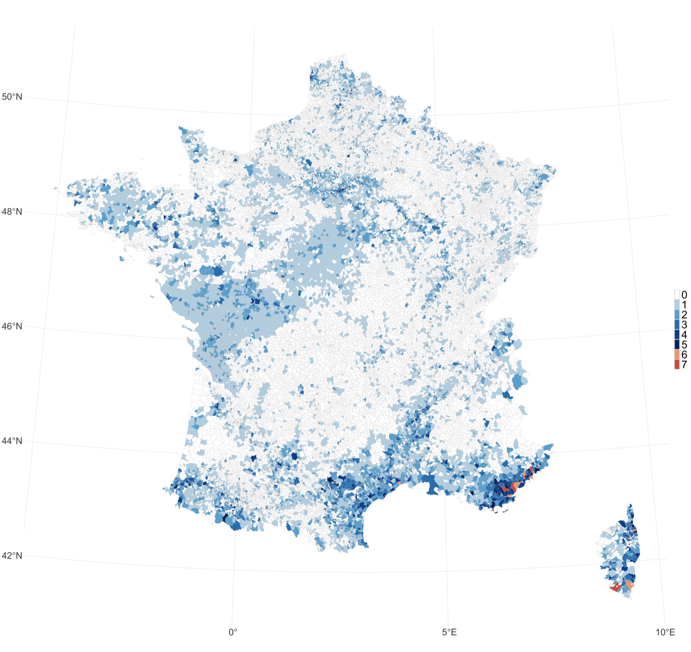{#fig-flood_map width="100%"}

Figure @fig-flood_map shows the number of flood-related Cat-Nat decrees issued between 2010 and 2019 across French communes. The spatial pattern is far from random: some regions are repeatedly exposed, while others never. Yet this variation reflects more than hydrological chance since firms and workers do not locate randomly. Some avoid naturally flood-prone lands, while others cluster in economically thriving river basins where defenses are stronger and infrastructure more reliable. As a result, observed flood exposure and economic activity may co-move not because floods reduce economic activity, but because productive firms and households sort into areas that are simultaneously high-risk and high-return. Figure @fig-risk_econ_acti therefore plots several measures of exposure to flooding and economic activity at the commune level to illustrate how flood risk correlates with covariates relevant for firm outcomes. These maps provide a descriptive overview, not a causal claim, but they highlight a central challenge: flooded and non-flooded communes differ systematically in ways that can confound naïve comparisons. For example, @jia2022expecting show that sorting of firms and workers into flood-prone areas is an important channel through which flood risk shapes long-run economic outcomes.

In France, a growing body of work shows that natural disaster decrees reflect social and institutional factors as much as hydrology [@CHELLE20251; @morvan2022municipalities; @grislain2018natural; @boissier2013mortalite; @bezy2023incidence]. For instance, @CHELLE20251 document large disparities in Cat-Nat and PPRI coverage across communes, correlated with income and local governance capacity: some high-risk communes with low economic activity remain excluded from formal protection, while others benefit from overlapping schemes. On the one hand, these discrepancies raise fundamental questions of equity and consistency in the distribution of climate risk and adaptation measures, highlighting the distributional dimension of flood policy. On the other hand, they underscore the need for careful identification strategies when measuring the impacts of flooding. As @lemoine2018estimating argue, certain adaptive responses can be observed and controlled for empirically, while others remain latent. Building on this, @carleton2024adaptation stress that both ex-ante and ex-post adaptation shape the observed impact of climate shocks, underscoring the importance of accounting for anticipatory behavior when interpreting flood effects on firms.

::: {#fig-risk_econ_acti layout-ncol="2"}
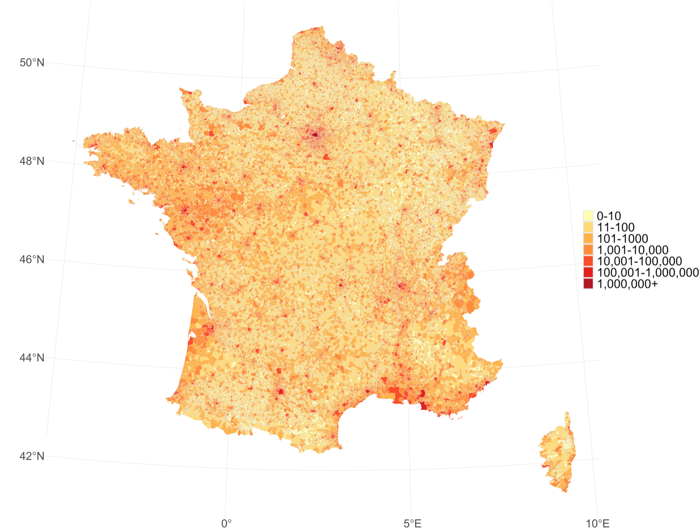{#fig-image4}

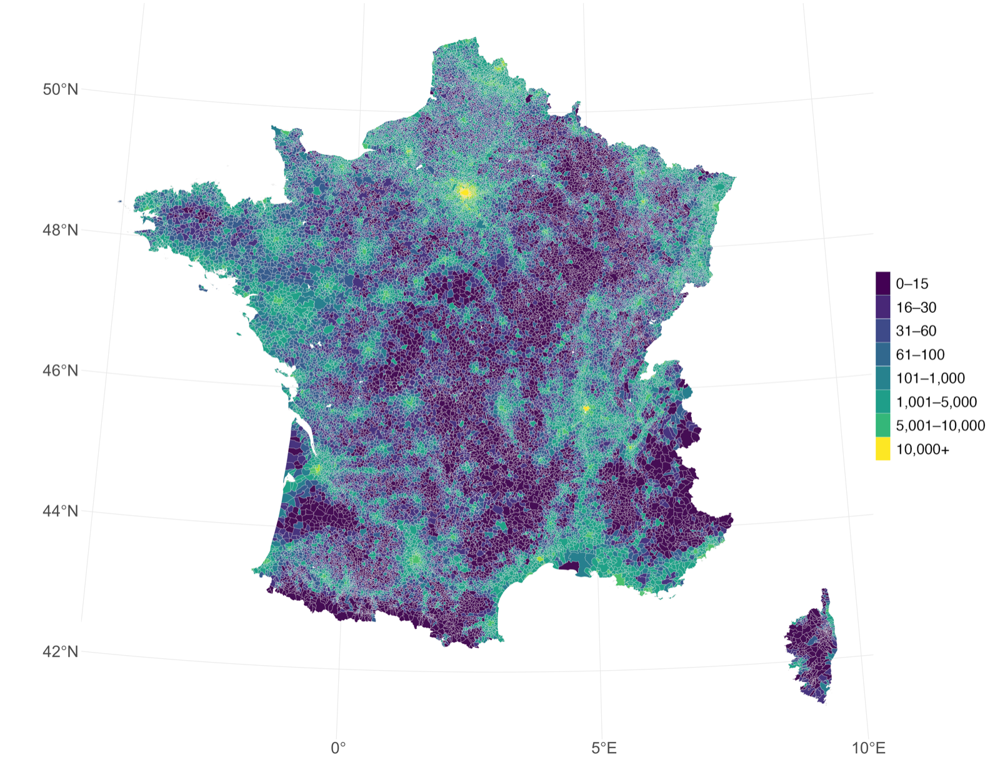{#fig-image5}

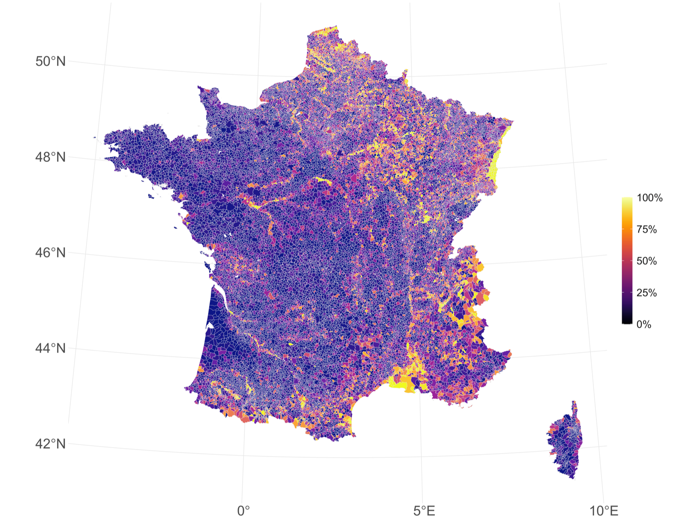{#fig-eaip_map}

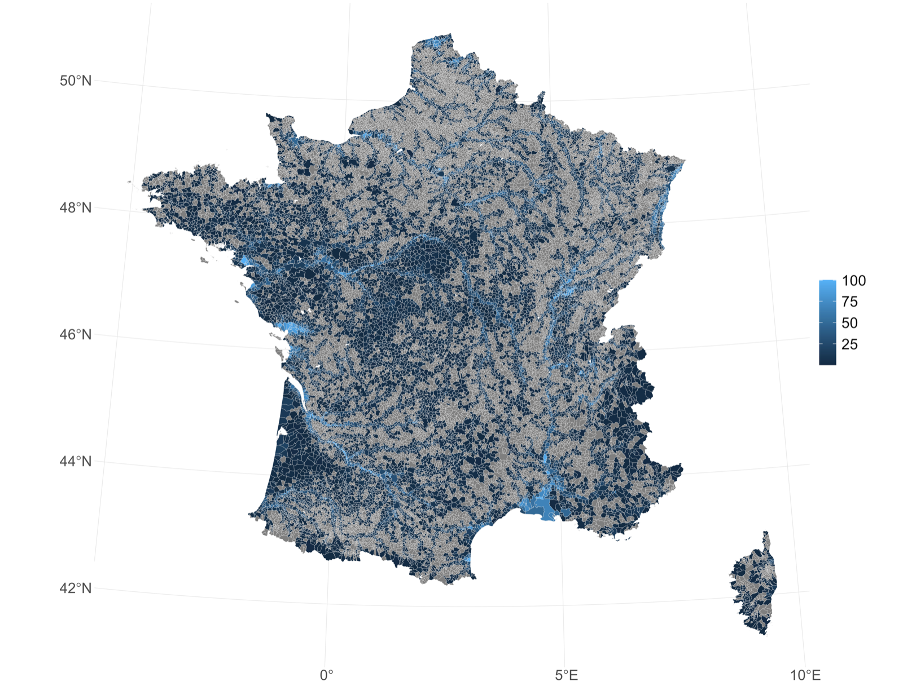{#fig-risk_index}

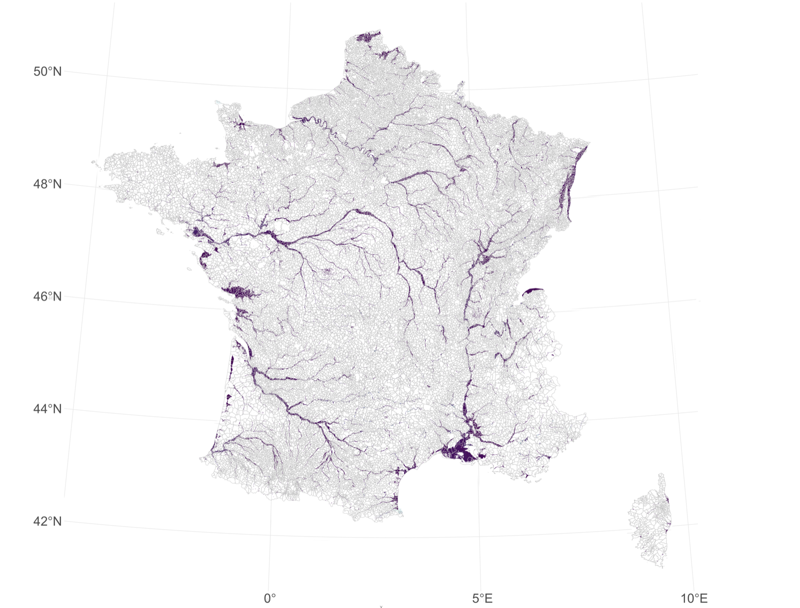{#fig-raster_unbinned_main}

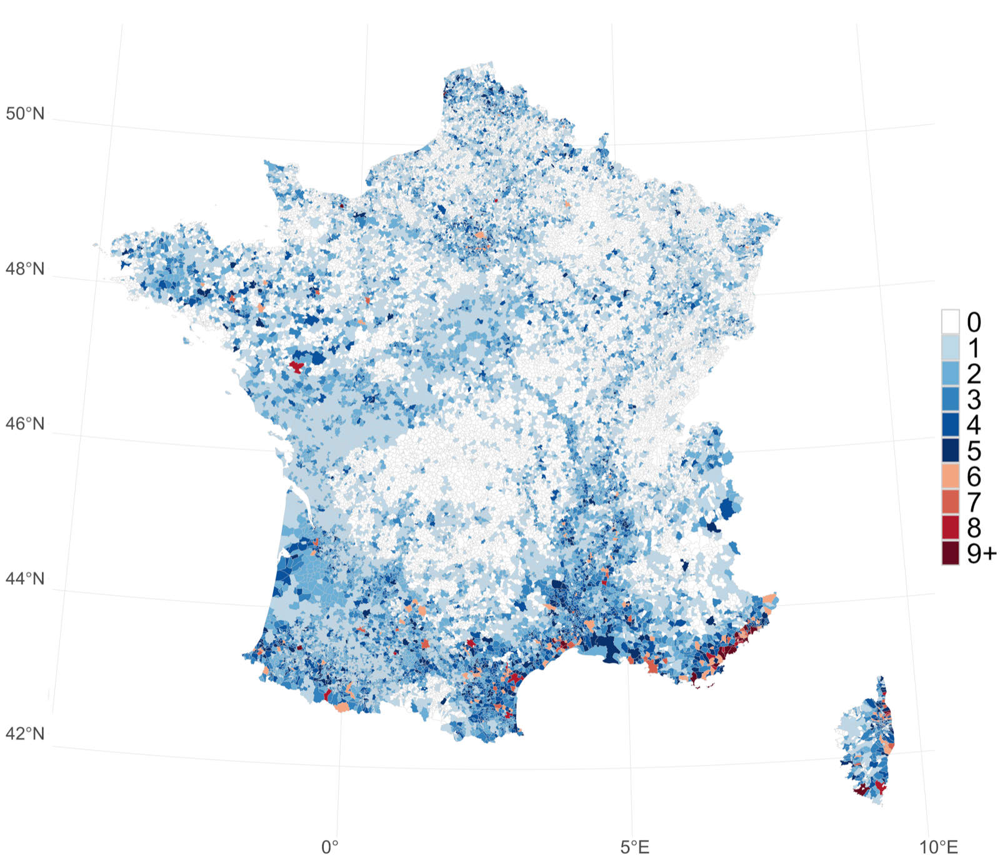{#fig-map_flood_2020}

Flood risk and economic activity at the commune level. Descriptive overview; Overseas France not shown.
:::

# Data sources {#sec-data}

I combine several data sources listed in Table @tbl-data_sources into an unbalanced panel of firms spanning 2010--2019. The dataset includes establishment-level financial and employment information, modeled flood risk measures, administrative records of historical flood events, and demographic characteristics at the commune level. Following @patel2023floods and @hussain2024flooding, I apply sample restrictions as part of my empirical strategy and retain only establishments with no recorded flood during the preceding 2000--2009 period. Table @tbl-summary_stats presents summary statistics for the final sample of establishments. I next describe the main data sources in turn.

  --------------------------- -------------------------- ----------------------- ---------------------------------------------------------------------------------------------------------------------------------------
                              *Data*                     *Source*                *Relevant Variables*
  1   Financial data             FARE-FICUS              Firm-level balance sheet data including value added, profit, and assets
  2                           Employment dynamics        DADS                    Establishment-level data on employment, wages, and sectoral classification
  3                           Historical flood records   GASPAR                  Administrative records of flood events by commune, including year, and type of flood
  3                           Flood exposure maps        Dottori et al. (2022)   Modeled flood risk for multiple return periods, including flood depth and area
  4                           Institutional overlays     ONRN, INSEE, FILOSOFI   Proportion and number of professional establishments present within EAIP coverage, litorale designation, disposable income by commune
  --------------------------- -------------------------- ----------------------- ---------------------------------------------------------------------------------------------------------------------------------------

  : Summary of data sources {#tbl-data_sources}

## Firm and labour market outcomes {#sec-data-3}

I use the administrative source DADS-Postes (*Déclarations Annuelles de Données Sociales*), an employer--employee matched dataset covering all employed individuals in France annually since 1995, accessed through the Secure Data Access Center (CASD). Collected by INSEE from mandatory employer filings, the DADS provides rich worker-level information, including age, gender, earnings, hours worked, and occupational category. A key strength of this dataset is the availability of actual hours worked, which allows for the calculation of hourly wages and a more precise measurement of labor inputs. The DADS panel also contains firm-level information (SIREN identifier, sector) and detailed job-spell data (start and end dates, earnings, occupation, and part-time/full-time status).

I match the DADS to firm-level balance sheet data from FICUS and its successor FARE (*Statistique structurelle annuelle d'entreprises*), available for 2008--2019. Compiled by the French tax authority based on mandatory annual financial filings, FARE provides comprehensive accounting information for nearly all firms operating in France. Because the balance sheet data are reported at the firm (SIREN) level, while the DADS are at the establishment (SIRET) level, I allocate each SIRET's share of its parent firm's accounts in proportion to the number of full-time equivalent employees it represents within the SIREN. From this, I construct establishment-level measures of key financial indicators such as sales, material costs, and capital expenditures. Additional details on variable definitions and construction are provided in Appendix @tbl-codebook.

## Flood declarations {#sec-data-1}

I use data from the publicly available GASPAR database, maintained by the French Ministry of Ecology, to determine the occurrence and timing of flood episodes. This database compiles all decrees (*arrêtés*) issued under the *Catastrophes Naturelles* (CatNat) regime since its creation in 1982. Each decree legally recognizes one or more communes as having experienced a natural disaster, indicating the disaster type, such as flooding or drought; the start and end dates of the disaster decree, and the date the decree was officially published in the *Journal Officiel*[^2] thereby entitling eligible parties within the affected communes to compensation through the CatNat insurance mechanism.

Although flood episodes are recorded with precise timing, their spatial resolution is limited to the commune level. In practice, flood damage is highly localized and even neighboring firms may experience different levels of disruption. My coarse commune-level definition of the flood treatment does not permit a detailed differentiation among plants which were/were not physically inundated. Assuming that all firms within a disaster-affected commune are equally exposed introduces measurement error and this could bias treatment effect estimates toward zero. To partly address these concerns, in my empirical design I proxy flood intensity with the time elapsed between start and end date of the CatNat decree is used, assigning to each flood episode a discrete intensity scale distinguishing between floods lasting less than 1 day, 1 to 22 days, and at least 23 days. This proxy of flood intensity is useful to disentangle chronic flooding from more extreme ones, which could have differential impacts and drive results. @erda2024disasters also relies on flood declarations at the county level when aiming to study their impact on firms, which raises similar identification challenges. Her approach is to use capital retirement variables to observe which firms did and did not retire capital in the same year as a flood, employing this as a proxy for being directly affected. Finally, an advantage of the GASPAR database is that it extends back to 1982, allowing the construction of flood history vectors that make it possible to compare firms or communes with similar "flood dosage" and ultimately to define treatment and control groups, a point to which we will return when discussing the empirical strategy of the paper.

## Floodplains and flood legislation layers {#sec-data-2}

Flood hazard maps show the depth, extent, and probability of inundation at any given location under hypothetical flood events of different magnitudes. They capture flood risk *at a given point in time* and help governments and local authorities identify high-risk areas and inform investments in resilience and defense planning. To isolate the impact of floods from other confounding factors, I use the hazard maps from @dottori_et_al_2022 to construct a long-term measure of flood risk. As a baseline indicator of exposure, I rely on the 100-year return period scenario, commonly used in insurance and urban planning, and assume the same risk profile for the full 2010--2019 study period. Specifically, I compute the percentage of each commune's surface that would be flooded and, for each 100m grid cell, retain the associated water depth. Figure @fig-raster_unbinned in the Appendix shows the floodplain map, while Figure @fig-risk_index plots the risk index I construct. Details on the construction of this index are provided in Appendix [7.1.2](#sec-appendix-risk-index).

Including this time-invariant commune-level variable in my specification improves comparability between treatment and control groups. I stratify the analysis by risk groups and include risk-group fixed effects. Related advances in the construction of long-term flood risk indices are presented in @hussain2024flooding. To further account for institutional legislation affecting exposure, I use the share of professional establishments within a commune that fall within an EAIP layer. Although partly political in nature---as discussed by @CHELLE20251---this measure helps increase balance between treatment and control groups.

||Mean|Std. Dev.|Obs|
|:---|---:|---:|---:|
| **Panel A: Establishment financial data (in 000€)** |  |  |  |
| Single-establishment (=1) | 0.41 | 0.49 | 6,820,861 |
| Current gross profit before tax | 102.27 | 7,010.94 | 6,820,859 |
| Loans and related debts | 1,077.50 | 52,861.74 | 6,820,859 |
| Total turnover | 3,063.17 | 45,734.96 | 6,820,853 |
| Wages and salaries | 550.67 | 6,575.77 | 6,820,861 |
| Value added | 922.16 | 10,069.92 | 6,820,861 |
| Share in: |  |  |  |
| Agriculture | 0.26 | -- | -- |
| Industries | 39.81 | -- | -- |
| Construction | 12.88 | -- | -- |
| Commerces | 23.01 | -- | -- |
| Services | 24.04 | -- | -- |
| **Panel B: Establishment employment data** |  |  |  |
| Number of salaried workers | 10.73 | 58.69 | 6,820,861 |
| Number of workers on Dec 31 | 8.82 | 20.35 | 6,793,155 |
| Average annual headcount | 11.27 | 62.56 | 6,793,155 |
| Full-time equivalents | 7.44 | 18.31 | 6,820,861 |
| Hourly wage (€) | 15.36 | 6.53 | 6,820,860 |
| Annual wage (€) | 18,986.40 | 17,240.86 | 6,820,861 |
| Annual wage on Dec 31 (€) | 21,935.71 | 13,240.98 | 6,153,385 |
| Share of contracts. ETP share in: |  |  |  |
| CDI | 0.76 | 0.31 | 6,762,208 |
| CDD | 0.15 | 0.25 | 6,762,208 |
| Interim | 0.00 | 0.00 | 6,762,208 |
| Other contract | 0.09 | 0.22 | 6,762,208 |
| **Panel C: Flooding and flood risk** |  |  |  |
| Flood risk index (RP100) | 11.73 | 16.56 | 6,820,861 |
| Coastal (=1) | 0.13 | 0.33 | 6,820,861 |
| Urban (=1) | 0.72 | 0.45 | 6,820,861 |
| Income level (€) | 20,363.64 | 3,409.63 | 6,808,677 |

: Summary statistics, 2010–2019 {#tbl-summary_stats}

*Note:* Panel A statistics are obtained weighting FARE-FICUS firm-level data by FTE employment in each establishment belonging to that firm. Tails of all variables are trimmed on both sides at 1% each year. Approximately 13% of firms are present throughout all 10 years, see @tbl-n_years_firms.

# Empirical strategy {#sec-empirical-strategy}

Following the institutional setting of the natural catastrophe declaration mechanism in France, I exploit the staggered arrival of floods recognised under the *CatNat* scheme to identify their dynamic effects on establishments. Estimating flood impacts is complicated by staggered timing and multiple treatments. Because traditional TWFEs DiDs estimators suffer from negative weighting issues in settings with dynamic and heterogeneous treatment effects, to address these issues, I follow the approach of [@wing2024stacked] and construct a matched "clean control" stacked panel in the spirit of the local projection DiDs (LP-DiD) estimator proposed in [@dube2023local]. The LP-DiD estimator has been used in recent disaster work such as @roth2020local, @gallagher2024natural, and @castro2024weathering. This framework also allows for a *non-absorbing* treatment. Non-absorbing specifications treat each flood as a separate, non-permanent shock and are therefore attractive when effects are truly linear and short-lived. Because in our setting lingering effects are likely, I ultimately adopt an absorbing specification. I focus on the first CatNat flood experienced by each establishment during 2010--2019 and measure the impact of *becoming* a flooded establishment.

## Establishment level

Let $i$ index establishments and $t\in\{2010,\dots,2019\}$. Define $T_i$ as the calendar year of the first *CatNat* flood at $i$ and set the absorbing treatment indicator $D_{it}$ equal one only in the event year $t$ such that $t-T_i=k$, where the omitted category is $k=-1$. Stacking a $\pm5$‑year window around $T_i$, I estimate for each $h\in\{-5,\dots,-2,0,\dots,5\}$: $$\begin{aligned}
\Delta_h Y_{it}
&=\sum_{k=-5,k\neq-1}^{5}\beta_k\,
      \mathbb 1\{t-T_i=k\}
  +X_{it}'\theta_h
  +\alpha_{g(i)s(i)}
  +\lambda_{g(i)s(i)}t
  +\lambda_{g(i)}t
  +\lambda_{s(i)}t
  +\delta_t^{(h)}
  +\varepsilon_{it}^{(h)},       \end{aligned}$$ where the dependent variable $\Delta_h Y_{it}=Y_{i,t+h}-Y_{i,t-1}$ is a long difference that removes permanent establishment heterogeneity. At every horizon, treated units are compared only to units that are guaranteed to remain untreated over the relevant window. Treated rows therefore consist of establishments that newly flood in year $t$, while "clean" comparisons are units with no floods in $t-1$, $t$, or the comparison year $t+h$. Establishments flooded earlier than $t-1$ or between $t+1$ and $t+h$ are dropped for that horizon, ensuring that controls are never contaminated by own treatment, ensuring all positive regression weights. The resulting coefficients $\hat\beta_k$'s are interpreted as horizon-specific average treatment effects and trace an impulse-response function in event time. Leads ($k<0$) provide a direct visual test of the parallel-trends assumption. Lags ($k\ge 0$) reveal the dynamic profile of outcomes in the aftermath of the flood. In this guide, the LP-DiD estimator is numerically equivalent to the stacked-DiD estimator in [@wing2024stacked].

Identification relies on the absence of pre-trends within finely defined risk--industry cells. To that end I absorb a full set of risk-group × industry fixed effects ($\alpha_{g(i)s(i)}$) and allow for three orthogonal linear trends: a group-by-industry trend $\lambda_{g(i)s(i)}t$, a pure group trend $\lambda_{g(i)}t$, and an industry trend $\lambda_{s(i)}t$. A horizon-specific calendar-year effect $\delta_t^{(h)}$ nets out macro shocks that differ across $h$. In line with [@patel2023floods] and [@hussain2024flooding] I build a control vector $\mathbf X_{it}$ containing rolling counts of floods in the previous three, five, and ten years, and a variables "years since flooding", soaking up lingering damage from earlier events, and I restrict the estimation sample to establishments that never flooded between 2000 and 2009, yielding a clean pre-treatments baseline. Standard errors are heteroskedasticity-robust and clustered at the unit level (establishments) to account for duplication, in accordance with the stacked DiDs literature.

To improve covariate balance, I further compute $\text{ATT}$‑type weights and report estimamtes with and without these additional weights that are put on top of the LP-DID's variance-weighted average of cohort-specific ATTs. To do this, I first estimate a propensity score for being hit by extreme flooding with a simple logistic regression model of the form:

$$\Pr\!\bigl(D_{it}=1 \,\big|\, X_i\bigr)=
\Phi\!\Bigl(\alpha\,X_{i}\Bigr)$$

@tbl-pscore_logit reports the result from the above logistic regression. The distribution of the propensity score without and with weights is shown in @fig-pscore_distr. As it can be seen in @fig-ps_cov_balance the balance of covariates is improved. I choose not to match on the propensity score, as matching would restrict the sample by dropping some treated observations and would shift the estimand from the ATT for all treated firms to the ATT for a smaller, selected subset. My weighted estimator preserves the full set of treated firms and avoids this loss of external validity. I however restrict the sample to the common support area, effectively dropping 2.12% of the sample, to improve internal validity.

## Commune level

The impact of flooding can vary based on the level of observation. While aggregate statistics may show signs of recovery or even growth after a disaster, this can be misleading because establishment‑level losses can be masked by reallocation toward unaffected areas: some establishments are severely flooded and decline or close, while others---less affected or even unaffected---expand and absorb displaced activity. This compositional change can make the region look healthy overall, even if many individual establishments suffer lasting losses. [@erda2024disasters] indeed documents a less dispersion in the marginal product of plant capital, indicating that flooding can cause an efficient reallocation of capital and labour. To investigate the impact of flooding on aggregate outcomes, I repeat the design described above at the commune level, with the specification for each horizon $h$:

$$\begin{aligned}
\Delta_h Y_{ct}
=\sum_{k=-5,k\neq-1}^{5}\gamma_k\,
   \mathbb 1\{t-T_c=k\}
  +Z_{ct}'\pi_h
  +\eta_{q(c)t}
  +\delta_t^{(h)}
  +\upsilon_{ct}^{(h)},                                   \label{eq:commune}\end{aligned}$$

Let $c$ index communes and define $q(c)\in\{\textit{littoral}\}\times\{\textit{urban}\}\times\{\textit{income}\}$ (the cross of coastality, urban status, and income tercile). $\Delta_h Y_{ct}=Y_{c,t+h}-Y_{c,t-1}$ and $\eta_{q(c)t}$ saturate stratum×year fixed effects. Standard errors cluster at the commune level. I further estimate the equation above inside each stratum -- coastal versus inland, urban versus rural, rich versus poor commune -- unless fewer than twenty treated communes are available.

# Results {#sec-results}

Floods can affect both supply and demand in the economy, making the overall impact on the outcomes of establishments uncertain. Disruptions to supply and infrastructure can increase costs for firms and encourage them to raise their prices or layoff workers. At the same time, job losses and lower household incomes, coupled with greater uncertainty, can depress demand. Turning to the effects on real economic activity in more detail, the impact of floods can vary greatly across sectors and regions. This section focuses on the impact of flooding measured on establishments outcomes and subsequently on those outcomes aggregated at the commune level.

## The impact of flooding on firms and workers

Figure @fig-firms_results plots the impulse response functions following a *CatNat* flood for two key outcomes---wages and headcount---measured at the end of the year (31.12). As shown, the estimated leads ($k < 0$) are uniformly insignificant, supporting the parallel-trends assumption, while the lags ($k \geq 0$) reveal significant and persistent losses. Scaling the average post-treatment coefficients in Table @tbl-lpdid_pooled by the sample means in Table @tbl-summary_stats indicates that the estimated wage effect of --233.6 corresponds to a reduction of roughly $–1.1\%$ in 31.12 wages, while the employment effect of --0.15 workers translates into a decline of about $–1.7\%$ in 31.12 headcount. Since yearly averages (@fig-avg_wage_firm and @fig-avg_eff_firm) do not display such pronounced movements, I interpret this as evidence of substantial rigidity in both wage-setting and layoffs in the French formal sector. One possible explanation is the strong enforcement of collective agreements by trade unions and employer associations.

It is instructive to compare these findings to other wage shocks in the literature---for example, those related to plant closures or mass layoffs. Such benchmarking would help assess whether floods generate disruptions of a similar scale, or whether wages respond differently to natural disasters. This comparison could also shed light on whether the labor market views climate-related shocks as primarily transitory or as persistent disruptions. The full set of coefficients underlying @fig-wage3112_firm and @fig-eff3112_firm can be found in Table @tbl-stacked_es_employment_wages, while additional event-study graphs for other outcomes are shown in Figure @fig-firms_extra_results.

Turning to contract composition, I do not find statistically significant changes in the share of permanent (CDI) versus temporary (CDD) contracts, although there is a modest but insignificant decline in CDD employment. This is consistent with the idea that end-of-year employment falls mainly because temporary workers are more easily dismissed than permanent staff, even if average yearly employment remains relatively stable. Furthermore, floods do not appear to reduce worker efficiency: hourly wages, a proxy for productivity per hour, remain broadly unchanged. Instead, the adjustment occurs through employment. However, the precise nature of this adjustment differs across measures. End-of-year headcount shows clear reductions, suggesting that separations take place around December 31, most likely through non-renewal of temporary contracts. By contrast, FTEs and turnover---which aggregate over the whole year---show little movement, indicating that these separations are concentrated in timing rather than reflecting sustained declines in labor input across the year. In other words, floods reduce employment at specific moments (the end of the year), but not enough to generate lasting losses in annual labor input or output.

The absence of clear effects on financial variables is also noteworthy. One explanation may be data limitations: monthly information on revenues and investments would be required to capture short-term disruptions, compensating capital expenditures, or capital retirement following floods. In addition, value added is not a clean measure of productivity, since it is endogenous to firms' pricing and input allocation decisions; a cost-function approach would be needed to recover total factor productivity (TFP). Finally, there is an economic rationale for why labor adjusts more quickly than output or profit: floods immediately disrupt commuting, staffing, and local services, while revenues and profits may be temporarily cushioned by insurance payouts, government relief, or demand shifts (e.g. replacement purchases).

::: {#fig-firms_results layout-ncol="2"}
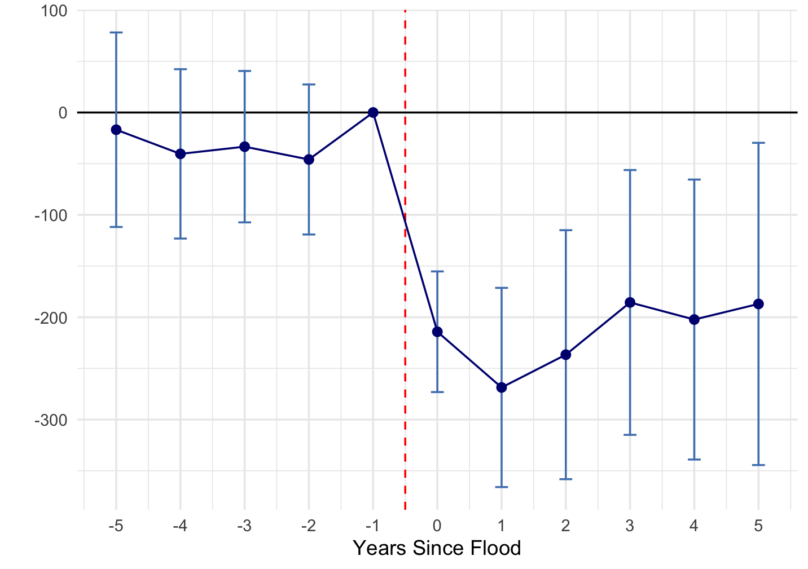{#fig-wage3112_firm}

{#fig-eff3112_firm}

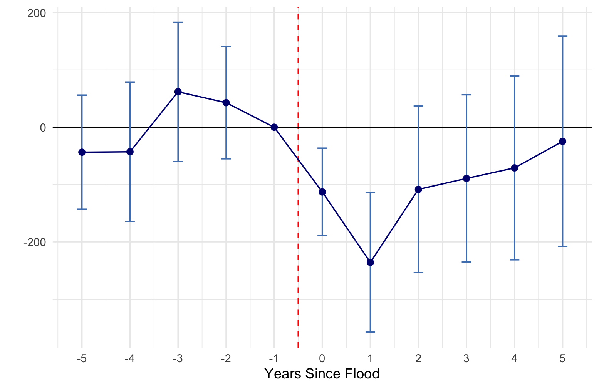{#fig-avg_wage_firm}

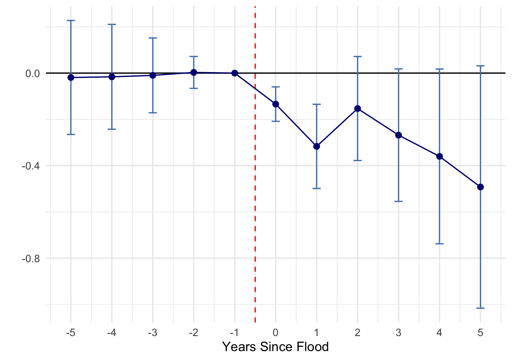{#fig-avg_eff_firm}

Impulse responses of wages and employment following a CatNat flood (establishment level, ATT-weighted where noted). Shaded bands are 95% confidence intervals.
:::

||Employment 31.12|Wages 31.12|Temporary contracts|Employment yearly|Hourly wages|Total revenue|
|:---|---:|---:|---:|---:|---:|---:|
| **Post-Treatment Average Effect** |  |  |  |  |  |  |
| *A. Full Sample* |  |  |  |  |  |  |
| Treated (=1) × Post (=1) | −0.151\*\*\* | −233.62\*\*\* | −0.0026 | −0.424 | −0.055 | 486.689 |
|  | (0.063) | (77.57) | (0.0025) | (0.287) | (0.033) | (263.316) |
| *B. By strata* |  |  |  |  |  |  |
| Mono-establishment (=1) | −0.022 | −524.13\*\*\* | −0.0052 | −0.0070 | −0.170\*\* | −15.388 |
|  | (0.012) | (127.62) | (0.0047) | (0.023) | (0.079) | (20.013) |
| Litorale (=1) | −0.134\* | −114.26 | −0.0130\*\* | −0.072 | 0.077 | 393.69 |
|  | (0.180) | (191.26) | (0.0059) | (0.347) | (0.076) | (448.64) |
| Mono-estab. (=1) × Litorale (=1) | −0.031 | −681.695\*\* | −0.038\*\* | −0.021 | 0.119 | −29.77 |
|  | (0.043) | (288.359) | (−0.0066) | (0.051) | (0.144) | (19.13) |
| Total observations | 6.82M | 6.82M | 6.82M | 6.82M | 6.82M | 6.82M |
| *Fixed effects* |  |  |  |  |  |  |
| Year | Yes | Yes | Yes | Yes | Yes | Yes |
| Commune | Yes | Yes | Yes | Yes | Yes | Yes |
| Flood risk group × Section × Year | Yes | Yes | Yes | Yes | Yes | Yes |
| Clustered SEs at establishment | Yes | Yes | Yes | Yes | Yes | Yes |

: Main LP-DiD estimates at establishment level {#tbl-lpdid_pooled}

*Note:* \*p<0.1, \*\*p<0.05, \*\*\*p<0.01. Standard errors in parentheses, clustered at the establishment level.

\
\

The subsample regression results indicate that the negative impact of flooding on firm wages is more pronounced for firms with a single establishment. This is consistent with the notion that multi-establishment firms can reallocate activity across locations and thereby cushion the effects of local shocks, whereas mono-establishment firms lack this adjustment margin and are thus more vulnerable. Beyond this dimension, it would be interesting to examine the role of tangible asset intensity, since physical capital such as plants, equipment, and warehouses is particularly susceptible to flood damage.

Finally, there is potential attrition at the extensive margin: plants that exit remain recorded in the DADS with zero workers, but may disappear entirely from the revenue panel. This can generate survivorship bias that dampens the estimated effects on sales or profits unless exits are explicitly coded as zero. Survival analyses, which are not undertaken in this paper, can be found in [@erda2024disasters], [@fatica2024floods], and [@clo2024impact]. A further limitation concerns the treatment definition. Commune-level flood dummies may adequately capture labor market disruptions, but they are likely to attenuate estimated effects on output when only part of an industrial zone is affected. Future specifications could address this by interacting the treatment with flood depth or with the share of commune area inundated, thereby capturing variation in exposure intensity more accurately.

## Sectoral heterogeneity in the impact of flooding

To understand how the effects of flooding vary across the economy, I explore heterogeneity along a key dimension: the sector of activity. Figure @fig-firms_results_heter displays event study estimates of average wage and headcount at the end of year ($31.12$), disaggregated by sector. Several patterns emerge.

::: {#fig-firms_results_heter layout-ncol="2"}
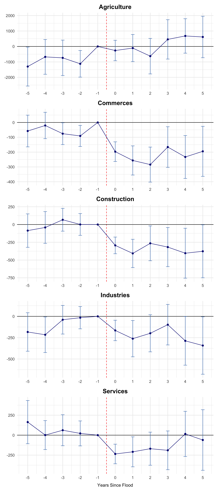{#fig-avg_wage_firm_heter}

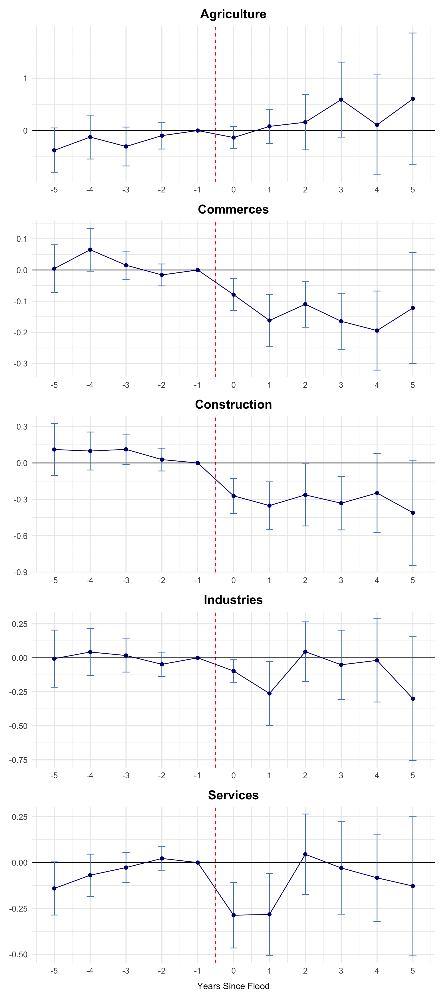{#fig-eff3112_firm_heter}

Event-study estimates by sector: average wage and headcount at 31.12.
:::

First, the parallel-trends assumption appears to hold across all sector panels: coefficients on the leads ($k = -5$ to $k = -2$) are statistically indistinguishable from zero, supporting the identifying assumption of the LP-DiD design. Turning to the post-flood dynamics, Panels (a) and (b) show that all sectors except agriculture experience some decline in average wages and employment, though the intensity and persistence vary considerably.

In commerce, employment drops sharply---by about 20% in the first year after a flood ($k=1$)---and losses persist through $k=5$. Construction suffers the most severe and prolonged effects, with employment falling by up to 30% around $k=3$, despite the potential for increased reconstruction demand. These results indicate that both sectors are especially vulnerable to flooding, likely due to their reliance on physical storefronts, infrastructure, and on-site activity. Services also show a persistent decline, though of a more moderate scale (10--15%). This suggests that local service providers face sustained challenges after floods, stemming from demand shifts, commuting disruptions, or damage to premises, and they may be unable to reorganize production flexibly, as argued by [@indaco2021hurricanes].

By contrast, the industrial sector shows little to no systematic response: coefficients fluctuate around zero and remain statistically insignificant, pointing to greater flood resilience, possibly due to larger capital buffers, insurance coverage, or geographic insulation from flood-prone areas. Similarly, the agricultural sector exhibits high variance but no consistent directional effect, with noisy estimates centered around zero. This pattern may reflect strong adaptation mechanisms in farming or substantial heterogeneity within the sector.

Taken together, these results suggest that sectors relying heavily on localized retail activity, manual labor, and in-person service delivery (commerce, construction, many services) bear the brunt of flood impacts. In contrast, sectors with more fixed capital, non-localized markets, or better insurance coverage (industry, agriculture) tend to show quicker recovery or minimal disruption. Importantly, these estimates are based on unweighted regressions. If sectoral heterogeneity shrinks or disappears when using inverse probability weights, this would imply that part of the observed variation reflects selection or compositional differences rather than true underlying disparities in vulnerability. Looking ahead, it would be interesting to examine whether floods also trigger climate transition-type reallocations across industries. Input--output data and information on downstream supplier relationships could help uncover whether flood shocks accelerate structural shifts in production networks.

## Commune level analysis

As aggregate dynamics can differ from individual dynamics, I also run a commune-level analysis, which is the level at which treatment is administratively assigned. It could be interesting in future work to extend this to Local Labour Market (LLM) zones, by interacting commuting zones and APE codes and weighting establishment outcomes by their labor shares in the LLM. At the commune level, however, the results show no strong or persistent impacts of floods on wages, employment, revenues, share capital, or profits (@fig-IRF_Communes). This contrasts with the establishment-level results, where floods generated sharp short-term shocks on wages and employment. The absence of aggregate effects highlights recovery dynamics at the municipal scale, consistent with findings in the literature. For instance, [@leiter2009creative] document that while Austrian firms suffered severe direct damages from floods, municipal-level aggregates showed relatively rapid recovery due to insurance payouts and redistribution. Similarly, [@usman2024going] stress that commune-level indicators often conceal heterogeneity in the impact of extreme weather events, as losses in some establishments are compensated by resilience and adaptation elsewhere in the local economy.

::: {#fig-IRF_Communes layout-ncol="2"}
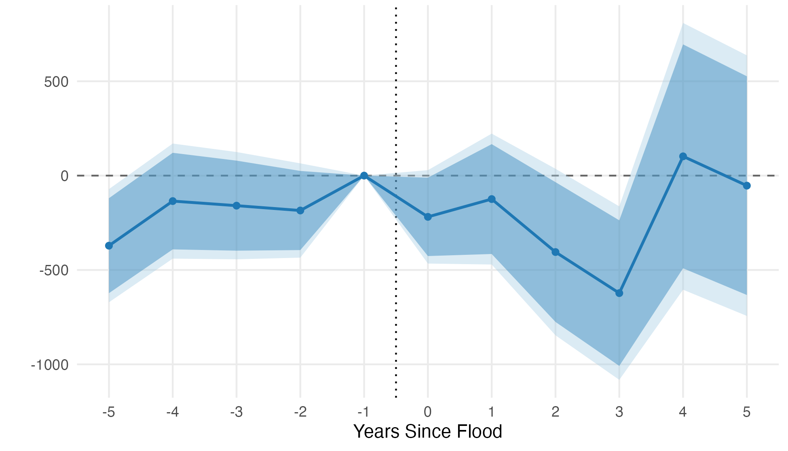

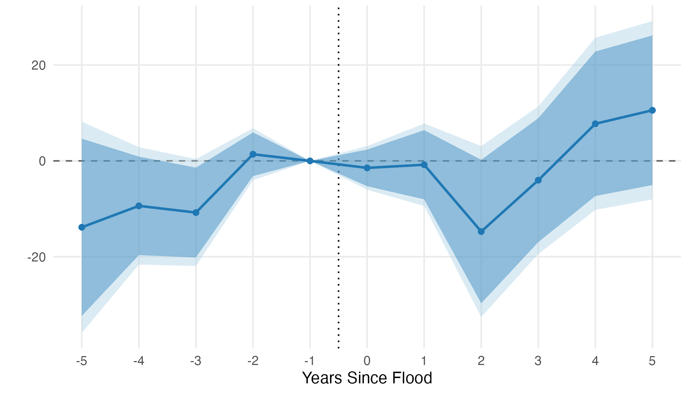{#fig-eff_all_commmune}

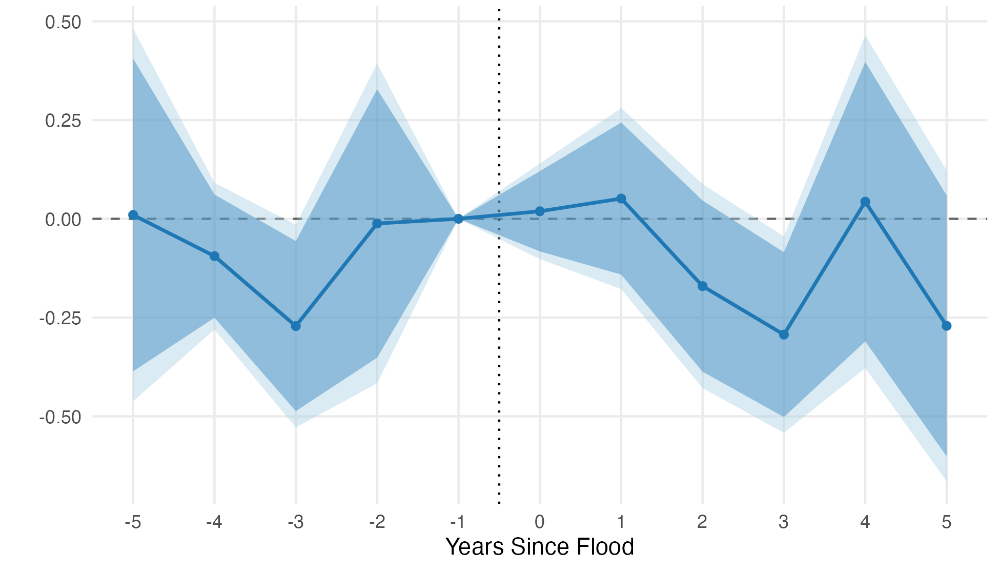

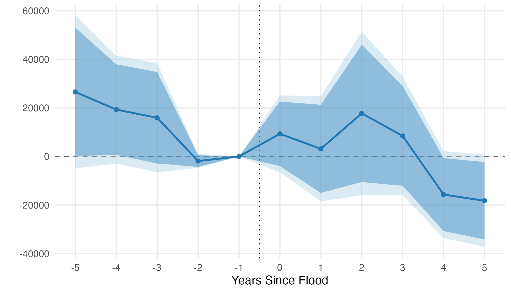

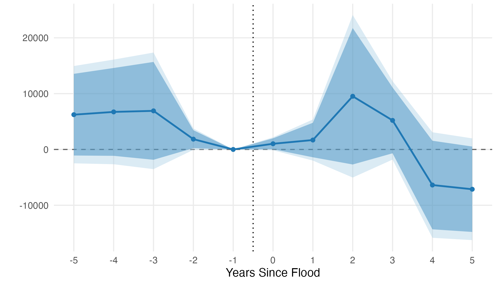

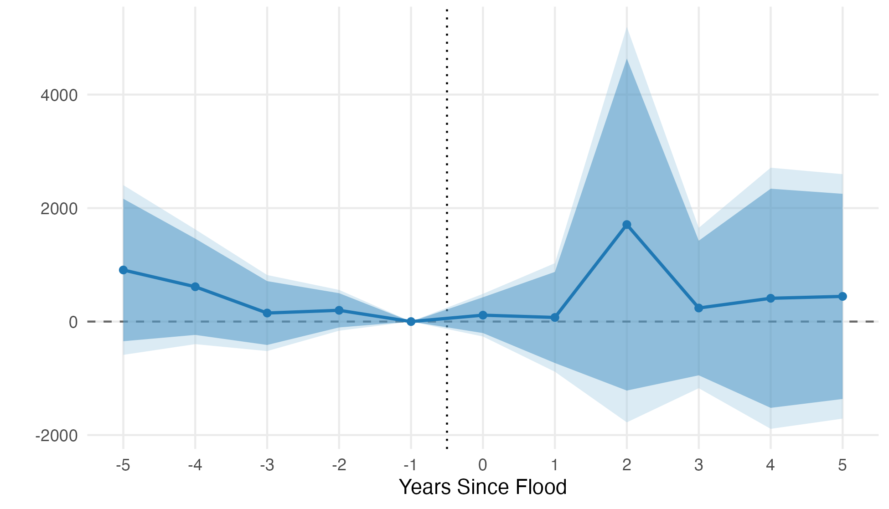

Commune-level impulse responses to a CatNat flood (pooled).
:::

::: {#fig-IRF_litorale_comparison layout-ncol="2"}
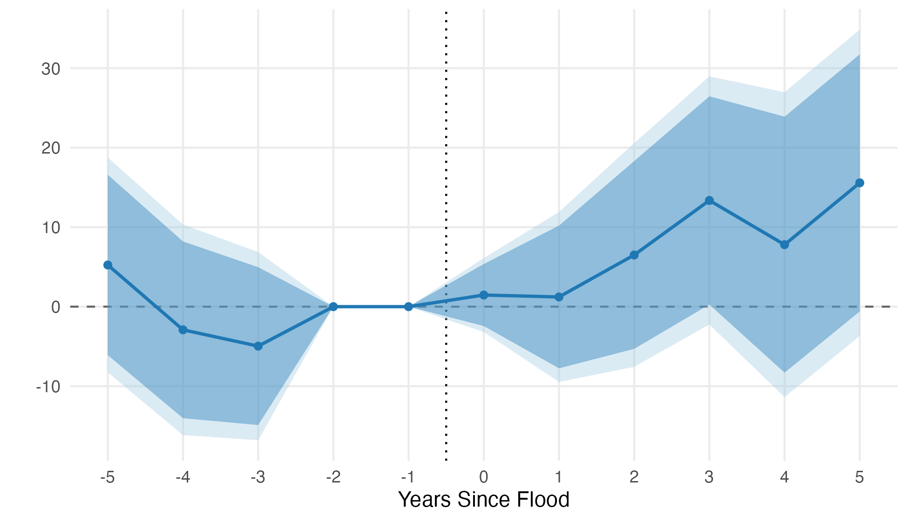

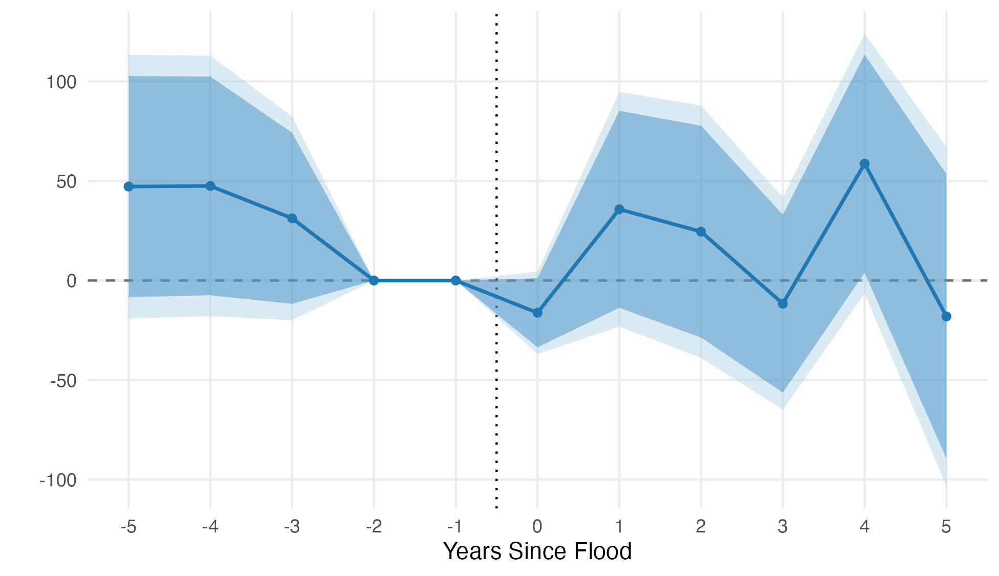

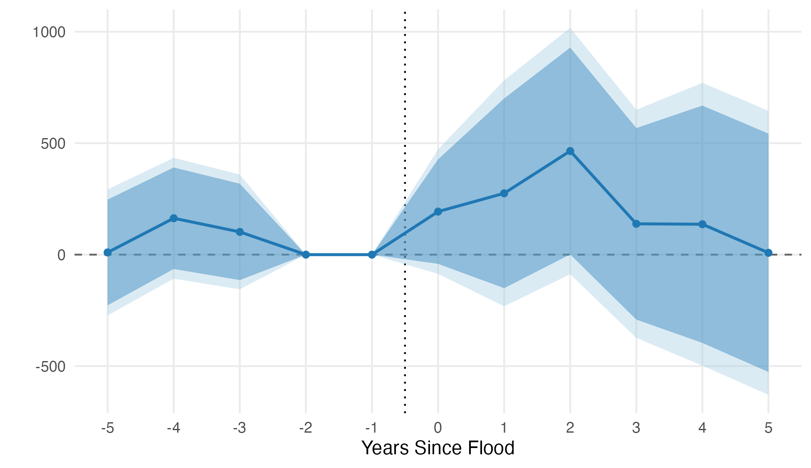

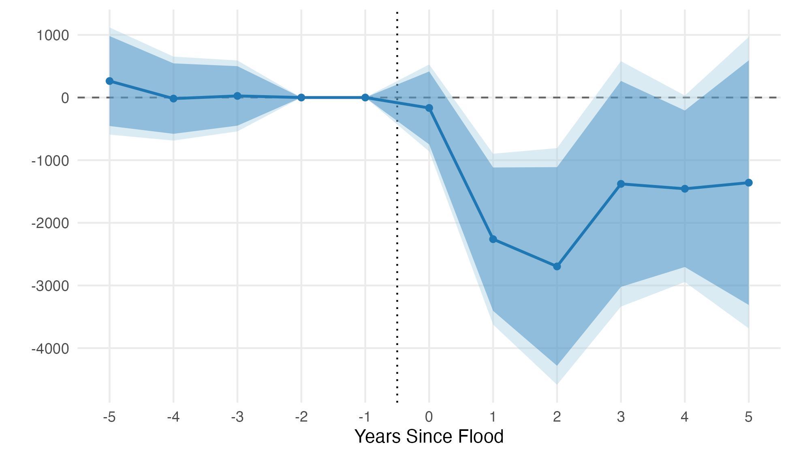

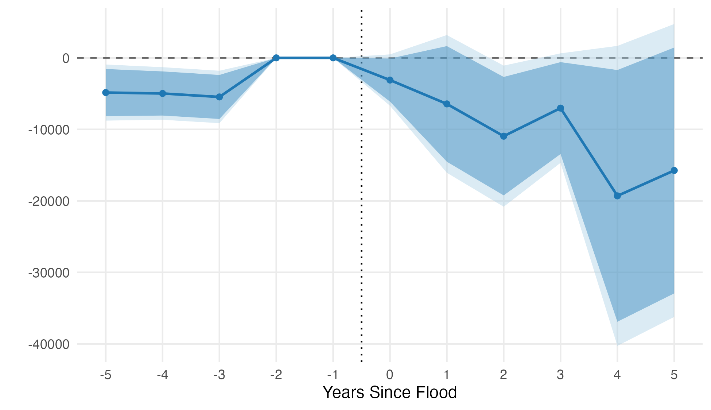

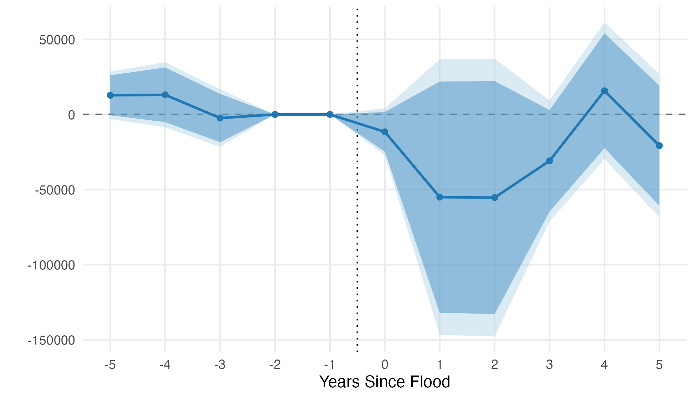

Commune-level impulse responses, inland (litorale = 0) vs. coastal (litorale = 1) communes.
:::

To examine heterogeneity, I stratify communes by coastal exposure. @fig-IRF_litorale_comparison shows that coastal communes experience somewhat larger short-term declines in revenues and wages following floods, whereas non-coastal communes exhibit flatter trajectories. The confidence intervals remain wide, so these patterns should be interpreted with caution. Still, the comparison suggests that exposure to the sea amplifies short-run damages, consistent with physical vulnerability and higher baseline flood risk in coastal areas.\
This designation of a flooding episode is place-based, tied to the specific communes affected, and primarily triggers compulsory insurance coverage for damages sustained. It does not automatically unlock substantial public funding for infrastructure reconstruction or direct fiscal transfers to households and firms. Nevertheless, it ensures regulated insurance payouts, offering financial relief to those affected. [@indaco2021hurricanes] find a similar mechanism at work in the U.S. hurricane context, where insured losses are quickly compensated but public transfers play only a minor role. Other mechanisms may also explain why aggregate effects appear muted. First, CCR insurance payouts cushion establishment-level losses and provide immediate liquidity, preventing wider economic dislocation. Second, firm entry and exit dynamics can rebalance local activity, with new entrants or expanding firms offsetting losses from those directly affected. Third, labor mobility between communes of work and residence helps smooth employment adjustments, as workers can shift jobs or commute elsewhere even if their local establishment is disrupted. Fourth, land use and cementification patterns condition how economic activity is exposed to flooding, with more built-up areas often facing higher direct damages but also faster recovery due to greater infrastructure and capital intensity. Finally, labor market regulation and unemployment insurance shape how shocks are absorbed: where firing costs are high, firms may adjust via capital rather than layoffs, while workers benefit from income smoothing through insurance or temporary withdrawal from the labor force.

These findings fit into a broader empirical pattern. [@roth2020local] shows that in U.S. counties, unlike hurricanes and tornadoes, floods tend to have a significant negative effect on US counties only in the year of the disaster, followed by a modest positive effect in the medium term, suggesting that aggregate recovery is rapid. [@bilal2023anticipating] emphasize that anticipation of climate risks influences location and investment decisions in the U.S., so observed damages may already reflect selection out of the most vulnerable areas. [@fatica2024floods] find that in Europe, financial resilience is shaped by insurance institutions and fiscal frameworks, which buffer aggregate outcomes even when establishment-level shocks are severe. Taken together, the evidence indicates that while establishments experience significant disruptions from floods, commune-level aggregates show limited persistent effects, reflecting the role of insurance, reallocation, and recovery mechanisms in attenuating shocks at higher levels of aggregation.

# Discussion {#sec-discussion}

This paper takes a broad view of floods as localized shocks that can propagate through place-specific labor and product markets. Assuming a local general equilibrium perspective as in [@kline2014people], shocks that reduce the demand for labor at a subset of establishments can lower workers' outside options and can raise effective monopsony power, implying that even modest employment losses translate into welfare reductions larger than the raw employment margin would suggest. My establishment-level estimates point to a persistent decline in end-of-year headcount of roughly 2% and a fall in end-of-year wages of about 1%, while hourly wages remain largely unchanged---consistent with an adjustment working primarily through employment timing and contract renewal rather than per-hour productivity. These findings motivate the core normative question of the paper: when do micro shocks cumulate into aggregate damage, and when do insurance, reallocation, and institutions buffer them away?

The answer in my data is a clear micro--macro wedge. At the establishment level, floods cause significant shock; at the commune level, impulse responses are flat and imprecise across outcomes, with only suggestive short-run effects in coastal communes. The contrast between Figure @fig-IRF_Communes and the plant-level results underscores that risk-sharing and spatial reallocation are first-order: local demand is buffered, workers commute or switch employers, and unaffected firms expand on the margin. In the coastal split, Figure @fig-IRF_litorale_comparison shows somewhat deeper short-run effects for litorale communes, but with wide confidence intervals. Together these patterns rationalize why commune aggregates can look resilient even when establishments experience sizable disruptions.

Policy follows directly from this logic. France's system layers (i) nearly universal insurance via the CatNat scheme, (ii) municipal fiscal responses, (iii) spatial planning through PPRI zoning, and (iv) information infrastructures (Géorisques, ERRIAL, Vigicrues). The first insures cash flow [@grislain2018natural]; the second supports public services and small-scale reconstruction [@morvan2022municipalities]; the third moves people and capital out of the worst places [@CHELLE20251]; the fourth reduces information frictions that otherwise impede private adaptation. Under fat-tailed risk, Weitzman's argument for precautionary weighting implies that early warning, zoning, and standards can carry large welfare payoffs even when average damages appear modest; empirically, the monetized benefits of European flood warnings are sizable [@pappenberger2015monetary]. At the same time, policy can create hazard, such as coastal hazard. For example, large coastal defenses in Jakarta induced relocation into risk, a textbook moral-hazard response [@hsiao2023sea]. Good adaptation policy therefore combines insurance and incentives: insure liquidity to avoid inefficient scarring, but price and regulate exposure to reduce chronic risk.

Heterogeneity matters for both inference and design. Vulnerability depends on demographics, land use, and preparedness [@boissier2013mortalite; @papagiannaki2022developing]. My measurement strategy therefore models intensity using decree duration and conditions on flood history, recognizing that the same hazard can map into different economic losses depending on prior investments and selection. This is squarely in line with recent classifications that cleanly separate hazard, exposure, and vulnerability [@kreibich2022challenge]. It also resonates with forward-looking spatial sorting emphasized by [@bilal2023anticipating]: if firms and households anticipate risk, observed damages partly reflect selection out of the worst places. Distributional concerns are central: U.S. floodplain regulation varies sharply by income and region [@cano2024exposing], and exposure is uneven across occupations [@reynier2024distributional]. Flat commune-level averages do not preclude large losses for the least mobile workers and the least diversified, mono-establishment firms---precisely the groups we find to be more vulnerable.

Methodologically, our estimand is the group--time ATT recovered with a stacked/local-projection DiD design that avoids negative-weight pathologies and uses only "clean" controls over symmetric windows around first exposure. This choice aligns with best practice when treatment is staggered and anticipatory behavior is plausible [@carleton2024adaptation]. Still, several measurement challenges remain. Commune treatment dummies attenuate effects when only a subset of plants are truly flooded; duration-based intensity bins can be biased by reverse causality (productive units drain faster, mechanically shortening measured duration) and by omitted vulnerability (long-duration floods are likelier in low-lying, poorer, agriculture-heavy places). Rich controls and flood-history vectors mitigate but cannot fully eliminate these concerns. Future work should incorporate depth, outage-days, capital retirement, and claims data to refine intensity; track exits explicitly to address survivorship in financial variables; and test robustness to alternative clean-control definitions suggested by the stacked-DiD literature.

The broader comparative evidence is consistent with our micro--macro wedge: for U.S. counties, floods have contemporaneous negative effects followed by modest medium-run rebounds [@roth2020local]; in Europe, insurance institutions and fiscal frameworks cushion aggregates even when establishment shocks are severe [@fatica2024floods]. Our coastal split echoes this: higher baseline exposure amplifies short-run losses but does not necessarily produce persistent commune-level scarring, again pointing to the importance of institutions and selection. If the policy objective is welfare rather than merely output, the case for action is strongest where outside options are thinnest and liquidity is scarce---that is, where the micro shocks we document are most likely to translate into persistent individual harm even when aggregates recover.

Two practical agendas follow. First, exploit institutional stagger---EAIP (post‑2007) and the expansion of PPRI coverage---to study how protection changes the mapping from hydrology to economic loss; today, roughly three-quarters of the French population live in a PPRI zone, offering quasi-experimental variation at scale. Second, push the spatial unit to economically meaningful labor markets (commuting-zone × APE) weighting establishments by labor shares to capture spillovers more cleanly. Complement this with mobility analyses using residential data to quantify post‑flood sorting [@lethimillock]. On the policy margin, early warnings, storm-water systems, permeable surfaces, and green infrastructure remain high--benefit tools; in agriculture, recent French evidence quantifies sizable adaptation and exposure costs [@du2024costs]. For developing countries, where fiscal capacity and governance constraints bind, the economics of adaptation highlights the role for external finance and careful program design [@kala2023climate], while evaluation must explicitly account for anticipatory adaptation [@carleton2024adaptation].

In sum, the paper's core message is simple. Floods deliver economically meaningful, persistent shocks to establishments; commune-level aggregates, however, look resilient because France's insurance, fiscal, and regulatory layers reallocate and insure the shock away. The policy task is therefore not only to raise average resilience but to reduce the dispersion of harm: target liquidity and reconstruction support to the most exposed, regulate and price chronic risk, and invest in information and planning that shift people and capital out of harm's way. Done well---and calibrated to fat tails---this adaptation package yields welfare gains even when aggregate IRFs are flat, precisely because it restores outside options in the places where they are scarcest.

# Conclusion {#sec-conclusion}

Flooding is set to remain a lasting challenge in France. A recent report by Réseau Action Climat (RAC) and Ademe [@RAC2024] provides a detailed region-by-region assessment of France's changing climate landscape, highlighting diverse climatic risks and vulnerabilities. Compared to the IPCC's global outlook, these assessments are more local in scale, and thus directly relevant for adaptation: they fill knowledge gaps where policy must operate. France's *Plan national d'adaptation au changement climatique* (PNACC), whose Measure 3 explicitly targets flooding, is one such framework, but its implementation has often been uneven and interrupted---underscoring the difficulty of sustaining long-term climate governance.

At the European level, recent debates---such as those raised in the Draghi Report---stress that climate policy cannot be separated from industrial policy. A green industrial strategy is increasingly necessary to overcome adaptation and mitigation barriers. In this regard, Earth observation systems such as Copernicus provide comprehensive, real-time data for environmental and climate monitoring, while new investments in green infrastructure and innovation are central to Europe's adaptation capacity.

It is important to recognize that the very notion of a "natural disaster" is not neutral. As the vulnerability paradigm emphasized since the 1970s, disasters are not solely the result of extreme environmental events but also of socio-economic and political conditions that make certain groups more susceptible to harm [@nations2010natural]. The IPCC's Sixth Assessment Report similarly stresses that changes in the frequency or magnitude of hazards do not directly translate into changes in risk if proactive management---such as protection or managed retreat---is undertaken [@Reisinger2020Concept]. In this sense, what appears as a sudden disaster is in fact the culmination of long-term exposure, behavior, and institutional choices. Climate change exacerbates these dynamics by introducing non-stationarity into natural systems, making past data a less reliable guide for future adaptation.

The urgency of this issue is underscored by recent events. The European State of the Climate 2024 reports that nearly one-third of Europe's river network flooded last year [@copernicus2024esotc]. In France, October 2024 floods in the Auvergne--Rhône--Alpes region brought 600 mm of rain in just 48 hours---roughly Paris's annual total---triggering widespread evacuations, crippling infrastructure, and leading the Ministry for Ecological Transition to relaunch the PNACC. Meteo France described the episode as the most intense rainfall over two days since the early 20th century. Similar catastrophic floods in Spain, Germany, and the Netherlands further illustrate the rising risks posed by climate extremes across Europe.

In light of the empirical evidence presented in this paper---showing that floods generate substantial microeconomic disruptions but muted aggregate effects---the conclusion is clear: institutional design matters. Insurance, fiscal buffers, spatial planning, and public information can prevent localized shocks from cascading into systemic crises. Yet climate change is intensifying the scale and frequency of hazards, and adaptation policies must be calibrated to fat-tailed risks, not historical averages. The challenge for France and Europe is to ensure that climate adaptation is not reactive but anticipatory, linking climate policy, industrial policy, and social protection. Doing so will not only reduce aggregate losses but also, crucially, limit the unequal distribution of harm across communities, workers, and firms.

# Appendices {#appendices .unnumbered}

## Data descriptions and variable creation details

This section details how the data used in this paper was collected and processed. I describe in turn the data sources mentioned in @tbl-data_sources. The codebook (@tbl-codebook) serves as further reference.

### GASPAR Database

In the raw GASPAR database, each row corresponds to a single hazard clause of a natural catastrophe decree published in the *Journal Officiel*---that is, one commune, one hazard, and one time window. Each decree is identified by a unique code CatNat, but when multiple hazards are recognized within the same decree (e.g. both flooding and landslides), the identifier is repeated, generating one row per hazard. As a result, raw counts of code CatNat overstate the number of distinct events. To avoid this double-counting, I collapse the data to the commune × hazard × calendar-year level, treating all rows that share these three keys as a single disaster episode within a commune. The resulting event counts are reported in @tbl-flood_summary. @fig-durat_categories plots the distribution of durations for all recorded flood events, which serves as the basis for defining my three categories of flood intensity.\

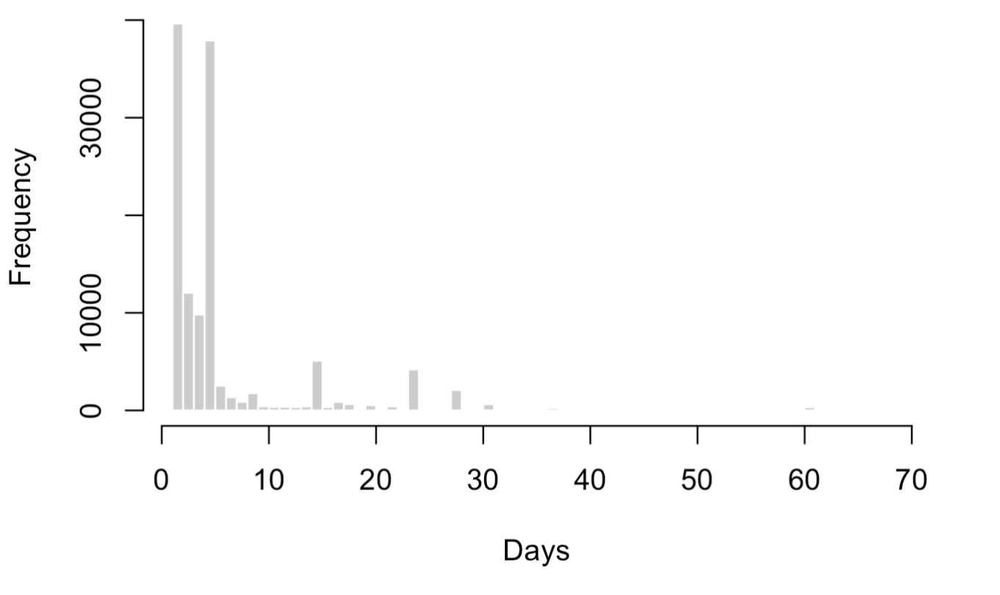{#fig-durat_categories width="90%"}

### Long Term Flood Exposure Index {#sec-appendix-risk-index}

Utilizing high‐resolution floodplain maps of Europe provided by @dottori_et_al_2022, I propose and develop a time-invariant flood risk index that is used to stratify the econometric analysis and guide sample selections. I choose the floodplain map with RP100 floods, indicating the extent of flooding that is statistically expected to be equaled or exceeded on average once every 100 years, a standard return period used in insurance and urban planning. I overlay the RP100 raster (GeoTIFF) data---a grid of 90m × 90m cells, each with a continuous value of water depth (in meters)---onto the polygons of all communes in metropolitan France. Counting how many of the raster cells fall within the boundaries of a commune, and then converting cell counts to surface areas, allows me to compute the percentage share of a commune's total area that is exposed to varying intensities of flood risk. Following categorization schemes used by the European Commission's [Risk Data Hub](https://drmkc.jrc.ec.europa.eu/risk-data-hub#/) and in the PESETA reports, I classify exposure intensity of each raster cell into four bands: $(0–0.5m]$, $(0.5–1.5m]$, $(1.5–3m]$, and $>3m$. The distribution of water depth values is heavily right-skewed, as shown in @fig-raster_values_distrib. For each commune, the risk index is simply built as the sum of four variables, capturing the proportion of the commune's total surface falling into each of the four depth bands, and excluding "unflooded" remainder. The risk index thus ranges from 0 to 100, and is plotted in @fig-risk_index; it can be conceived as the share of each commune's surface that is colored in purple in @fig-raster_unbinned. Several flood risk or exposure indices are used in the academic literature---alongside [@indaco2024adapting] and [@hussain2024flooding]. Other indices range from global event-based [@okazawa2011development], local exposure-vulnerability [@anindita2020flood], GIS susceptibility models, to composite social-exposure indices and macro-scale global indices (WorldRiskIndex). These indices go in the direction of the damage function in [@carleton2022valuing] and, more specifically for our application, the damage functions in [@bilal2023anticipating].

This measure of flood hazard could be refined in several ways. Rather than relying on a simple sum of flooded area across intensity categories, a weighted sum---placing greater emphasis on more severe flooding---would better reflect the nonlinear relationship between water depth and economic damage often observed in engineering and insurance data [@ballocci2024econometric]. For example, a commune that is 30% flooded at 2 meters likely faces far greater losses than one that is 100% flooded at 5 cm. Similarly, exploiting multiple return periods (e.g., RP10 vs. RP500) would allow the index to capture temporal variation in exposure, distinguishing between persistently exposed areas and those facing latent, tail risks. These "risk-jumpers" can be identified by subtracting RP10 from RP500 flood depths---a difference that preliminary analysis has shown to be minimal in most regions but notable in places like the Loire Valley around the city of Orléans, highlighting the importance of such hazard maps in informing investments in resilience across France. As explained in @sec-discussion, to improve precision of my estimates, beyond the risk index I include other time-invariant covariates in my specification, such as the share of establishments covered by EAIP (@fig-eaip_map) and commune median revenue. I also test other covariates that could have been included directly in the index. @tbl-pscore_logit shows results.

Finally, in integrated structural models of climate change, a flood risk index at the commune level could act as an amenity shifter that affects the relative desirability of locations. Households and firms are assumed to sort spatially based on wages, prices, and local amenities, influencing spatial sorting and long-run equilibrium under evolving climate risk. By simulating these equilibria under different flood scenarios (e.g., comparing RP10 vs. RP500), the model can generate forward-looking predictions of where people and firms are likely to concentrate or retreat.

::: {#fig-raster layout-ncol="1"}
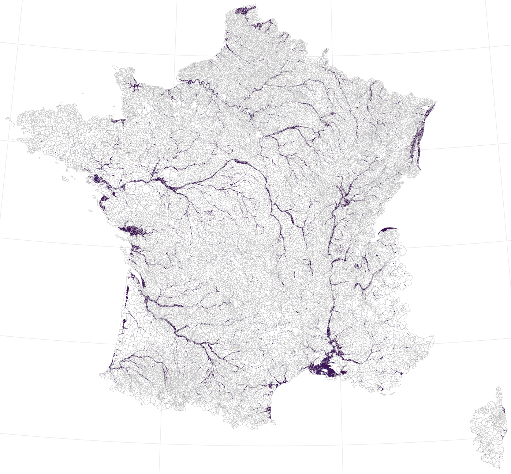{#fig-raster_unbinned}

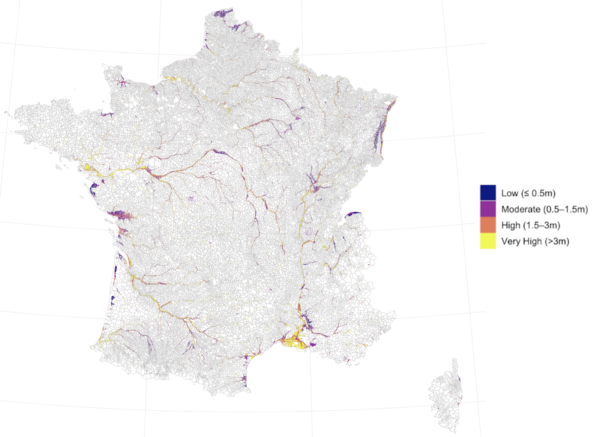{#fig-raster_binned}

RP100 flood-depth raster over metropolitan France: continuous water depth (top) and binned depth categories (bottom).
:::

{#fig-raster_values_distrib width="70%"}

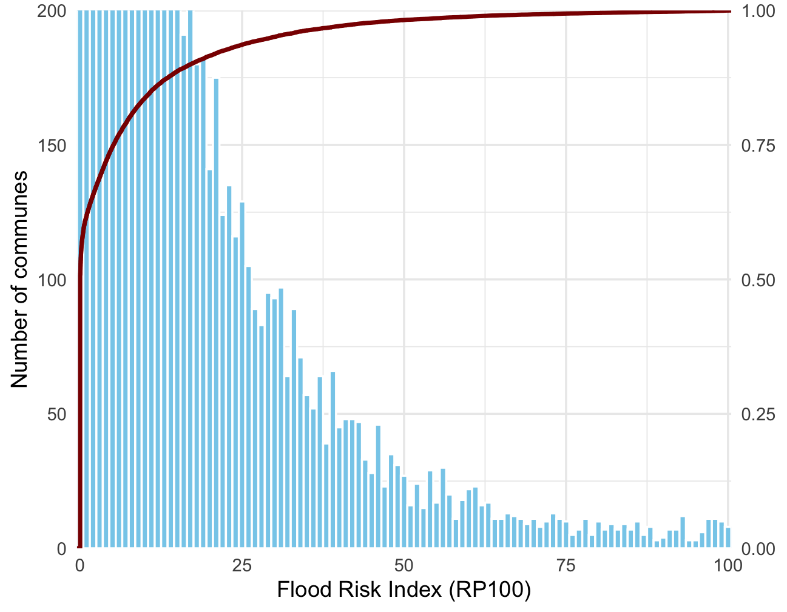{#fig-risk_disribu width="70%"}

### Propensity Score {#sec-pscore-appendix}

To improve covariate balance between treated and control firms, and hence precision, I estimate a propensity score for flood exposure using pre-determined firm and location characteristics, following a specification similar to [@fatica2024floods].

As long as unconfoundedness is assumed and common support is established, IPW estimators can be used to estimate ATE and ATT effects. While ATE weights ask what would happen if a randomly selected firm were flooded, ATT weights estimate how floods affected firms that were actually flooded. Given my interest in realized flood shocks, I focus on the ATT. I examine the distribution of the propensity score across treatment status. I then use the score to construct analytical weights. The ATT weights are of the form:

$$\begin{aligned}
 w_1^{att}(D) &= \frac{D}{\mathbb{E}[D]}, \\ w_0^{att}(D, p(X)) &= \frac{\frac{(1 - D)p(X)}{1 - p(X)}}{\mathbb{E}\left[ \frac{(1 - D)p(X)}{1 - p(X)} \right]}. \end{aligned}$$

I begin with a pooled logit that relies only on time-invariant firm characteristics, whose result is presented in @tbl-pscore_logit. Once the propensity score is known, I build the ATT weights as described above and proceed with standard inference procedures, re-estimate the outcome model on this re-weighted sample. The distribution of $p(x)$ in the adjusted and unadjusted sample is shown in @fig-pscore_distr, while @fig-ps_cov_balance illustrates the improvement in covariate balance achieved by the computed weights.

||Extreme-flood dummy|
|:---|---:|
| Flood--risk-group decile | 0.160\*\*\* |
|  | (0.029) |
| Share of establishments under EAIP | 0.219 |
|  | (0.280) |
| Income category of commune | 0.0334 |
|  | (0.088) |
| Urban dummy | 0.456\*\*\* |
|  | (0.073) |
| Coastal dummy (littoral sea) | 0.908\*\*\* |
|  | (0.127) |
| Floods 1982--1999 (count) | −0.118\*\*\* |
|  | (0.044) |
| Constant | −3.476\*\*\* |
|  | (0.206) |
| Observations | 6,676,631 |
| Wald χ²(6) | 178.33 |
| Pseudo R² | 0.0293 |
| Log pseudolikelihood | −1,564,659.3 |

: Pooled logit model for extreme-flood exposure (propensity score) {#tbl-pscore_logit}

*Note:* \*\*\*p<0.01. Robust standard errors in parentheses.

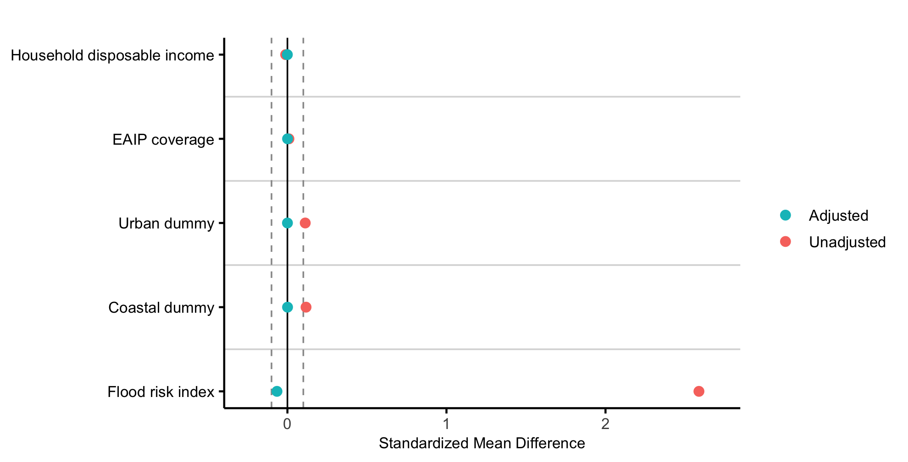{#fig-ps_cov_balance width="86%"}

{#fig-pscore_distr width="100%"}

## Additional empirical results {#sec-appendix-empirical}

||Employment 31.12 (1)|Employment 31.12 (2)|Wages 31.12 (1)|Wages 31.12 (2)|
|:---|---:|---:|---:|---:|
| **A. Post-Treatment Average Effect** |  |  |  |  |
| Treated × Post | −0.071 | −0.150\*\* | −135.01\*\*\* | −233.62\*\*\* |
|  | (0.045) | (0.063) | (41.98) | (77.57) |
| **B. Event-Study Estimates** |  |  |  |  |
| Treated × Event-time, $-5$ | −0.028 | −0.031 | −48.52 | −16.83 |
|  | (0.021) | (0.033) | (31.91) | (48.47) |
| Treated × Event-time, $-4$ | 0.008 | 0.027 | −52.54\*\* | −40.41 |
|  | (0.015) | (0.027) | (26.37) | (42.21) |
| Treated × Event-time, $-3$ | −0.013 | 0.015 | 17.24 | −33.38 |
|  | (0.014) | (0.019) | (25.30) | (37.73) |
| Treated × Event-time, $-2$ | −0.013 | −0.004 | −2.72 | −45.89 |
|  | (0.013) | (0.016) | (25.38) | (37.39) |
| Treated × Event-time, 0 | −0.083\*\*\* | −0.169\*\*\* | −186.67\*\*\* | −214.19\*\*\* |
|  | (0.020) | (0.040) | (19.88) | (30.07) |
| Treated × Event-time, $+1$ | −0.114\*\*\* | −0.230\*\*\* | −122.83\*\*\* | −268.61\*\*\* |
|  | (0.036) | (0.055) | (27.40) | (49.05) |
| Treated × Event-time, $+2$ | −0.057\* | −0.088\* | −186.74\*\*\* | −236.09\*\*\* |
|  | (0.029) | (0.045) | (27.62) | (62.64) |
| Treated × Event-time, $+3$ | −0.216\*\*\* | −0.144\*\*\* | −165.92\*\*\* | −185.56\*\*\* |
|  | (0.042) | (0.055) | (31.77) | (65.99) |
| Treated × Event-time, $+4$ | −0.132\*\*\* | −0.163\*\*\* | −180.45\*\*\* | −202.26\*\*\* |
|  | (0.034) | (0.056) | (38.06) | (69.77) |
| Treated × Event-time, $+5$ | −0.124\*\* | −0.176\*\* | −84.79\* | −187.39\*\* |
|  | (0.056) | (0.082) | (47.21) | (80.31) |
| Total observations | 6.82M | 6.82M | 6.82M | 6.82M |
| Variance weighted (stacked) weights | Yes | Yes | Yes | Yes |
| ATT weights | No | Yes | No | Yes |
| Fixed effects | Yes | Yes | Yes | Yes |

: LP-DiD event-study coefficients: employment and wages at 31.12 {#tbl-stacked_es_employment_wages}

*Note:* Column (1) uses variance (stacked) weights only; column (2) adds ATT weights. \*p<0.1, \*\*p<0.05, \*\*\*p<0.01. SEs clustered at establishment level.

::: {#fig-firms_extra_results layout-ncol="2"}
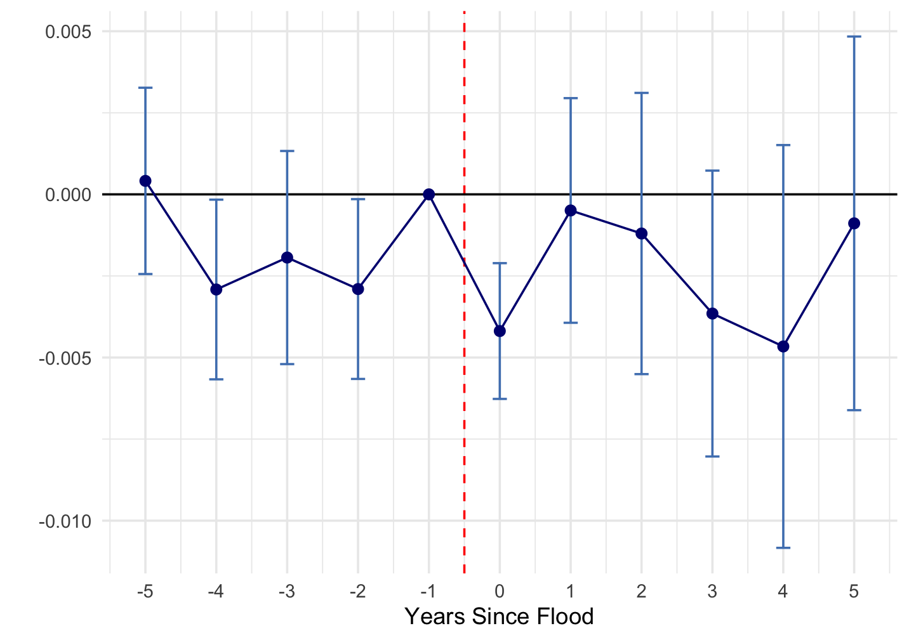

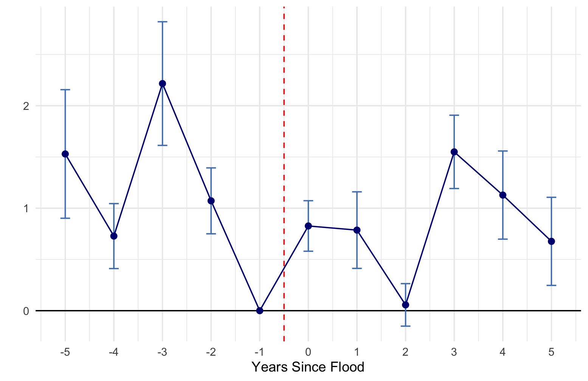

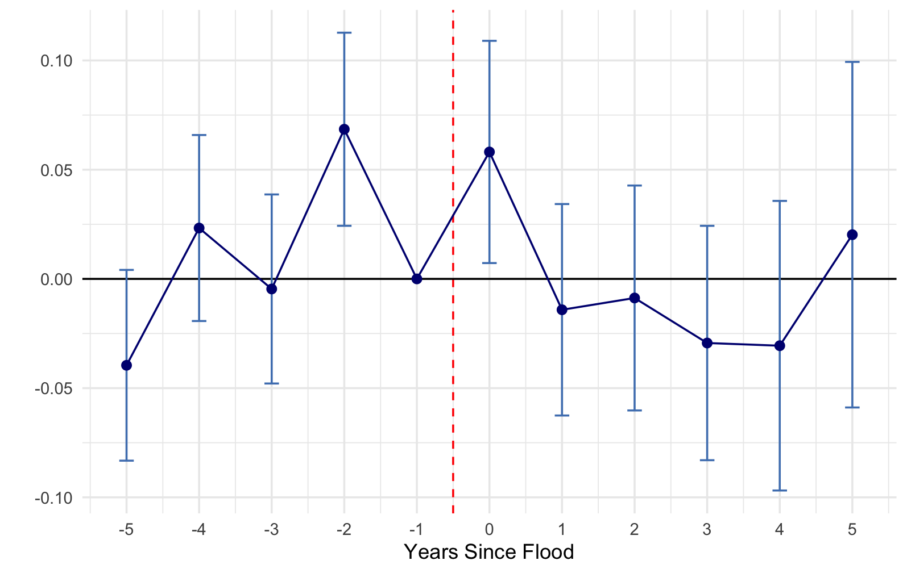

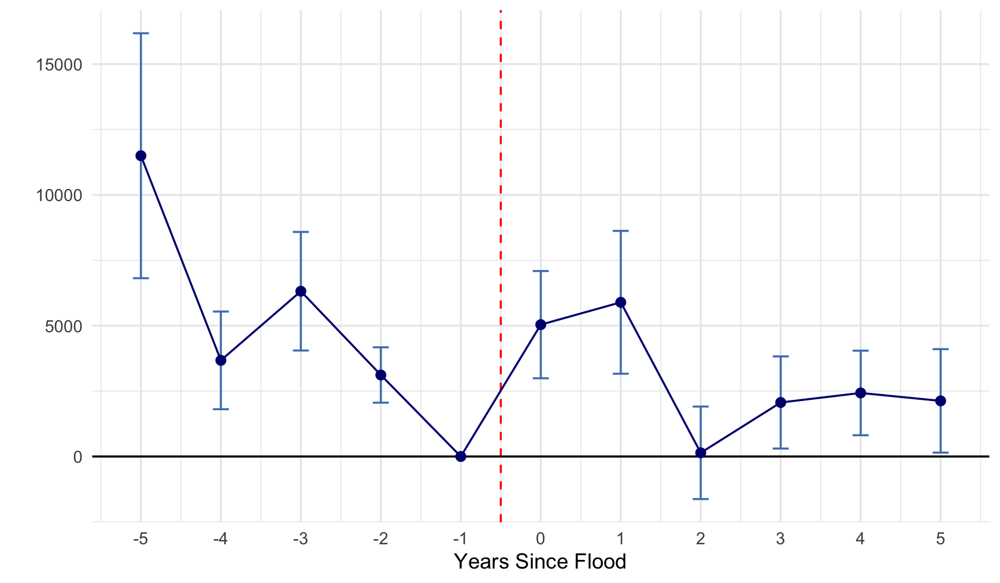

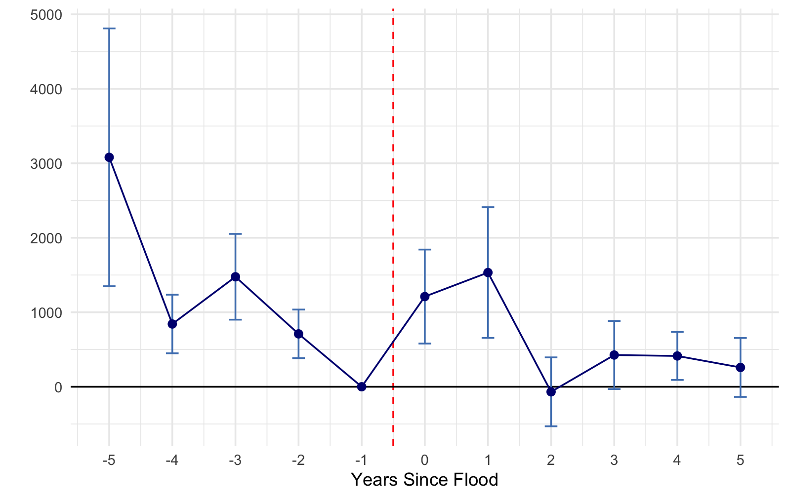

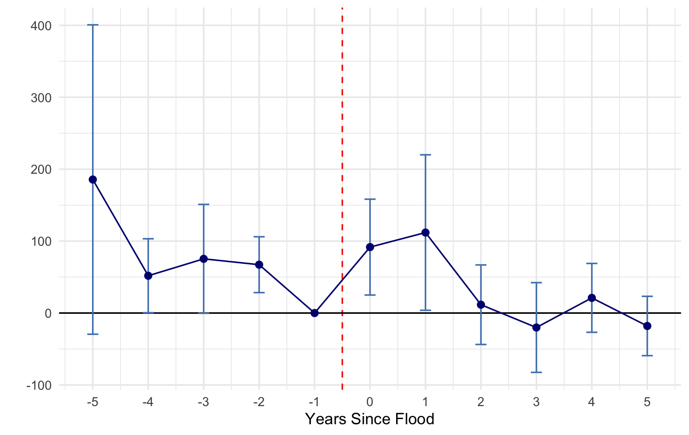

Additional establishment-level impulse responses.
:::

## Additional tables {#sec-appendix-tables}

  ----------------- -------------------- ----------------------- --------------------------- ------------ ----------------------------- -------------- -------------- ----------------
                      **CatNat decrees**   **Communes affected**         **Firms in sample**                                                                          
  2000                                33                   2 227                          --           --                            --             --             --               --
  2001                                42                   2 879                          --           --                            --             --             --               --
  2002                                27                   1 163                          --           --                            --             --             --               --
  2003                                27                   2 261                          --           --                            --             --             --               --
  2004                                19                     334                          --           --                            --             --             --               --
  2005                                21                     842                          --           --                            --             --             --               --
  2006                                24                   1 072                          --           --                            --             --             --               --
  2007                                19                   1 070                          --           --                            --             --             --               --
  2008                                26                   2 177                          --           --                            --             --             --               --
  2009                                23                   4 425                          --           --                            --             --             --               --
  2010                                23                   1 981                      24 107       43 415                             0         67 522        587 707            10.31
  2011                                23                     962                      25 834       35 847                             0         61 681        669 845             8.43
  2012                                18                     729                      16 350       11 930                            21         28 301        635 386             4.26
  2013                                31                   1 511                      29 098       40 948                           145         70 191        607 992            10.35
  2014                                33                   2 057                      26 898       82 310                           129        109 337        609 840            15.20
  2015                                22                     776                      48 124       12 579                             2         60 705        629 434             8.80
  2016                                29                   2 846                      28 609       61 608                            21         90 238        546 372            14.17
  2017                                23                     303                      15 063        2 017                             0         17 080        666 863             2.50
  2018                                37                   3 426                      76 373       96 275                           753        173 401        663 240            20.73
  2019                                26                     913                      29 246       63 188                             0         92 434        728 887            11.26
  2020                                28                   1 168                          --           --                            --             --             --               --
  ----------------- -------------------- ----------------------- --------------------------- ------------ ----------------------------- -------------- -------------- ----------------

  : History of flood events, affected communes and firms {#tbl-flood_summary}

*Notes:* "Affected" firms are disaggregated by flood duration: less than 1 day (low), 1--22 days, and >22 days (high). The flood rate (%) is the share of affected firms over the total observed firms in a given year.

  Total floods        SIRETs   Low (1 day)   Medium (1--22 days)   High (>22 days)   Avg. years between
  -------------- ----------- ------------- --------------------- ------------------------------------ --------------------
  0                1 455 888            --                    --                                   --                   --
  1                  445 886       180 317               264 724                                  845                   --
  2                   95 527        80 767               110 084                                  203                 1.39
  3                   27 988        37 561                46 380                                   23                 1.34
  4                    9 592        16 628                21 740                                    0                 1.30
  5                    1 799         3 469                 5 526                                    0                 1.28
  6                      422           929                 1 603                                    0                 1.24
  7                       13            31                    60                                    0                 1.06
  Total            2 037 115            --                    --                                   --                   --

  : Flood statistics (2010--2019) {#tbl-flood_counts19}

*Notes:* Flood counts refer to the number of floods experienced by a commune between 2010 and 2019. Low/Medium/High intensity is based on total duration of the CatNat decree.

   Years Present   Frequency   Percent   Cumulative
  --------------- ----------- --------- ------------
         1          600,750     8.81        8.81
         2          840,246     12.32      21.13
         3          842,433     12.35      33.48
         4          829,720     12.16      45.64
         5          720,665     10.57      56.21
         6          694,524     10.18      66.39
         7          513,807     7.53       73.92
         8          511,576     7.50       81.42
         9          364,680     5.35       86.77
        10          902,460     13.23      100.00
       Total       6,820,861   100.00        --

  : Number of Years Firms Appear in the Data (2010--2019) {#tbl-n_years_firms}

*Notes:* This table shows how many years (out of 10 between 2010 and 2019) each SIRET appears in the data. Approximately 13% of firms are present for the full decade.

  **Variable**                                                        **Description**
  ------------------------------------------------------------------- -------------------------------------------
  `SIREN`                                                             Legal-unit identifier
  `ANNEE`                                                             Calendar year
  `depcom`                                                            Commune code (head office)
  `ape_diff`                                                          Main activity (NAF Rev. 1)
  `r004`                                                              VAHT -- IMPOTAX + SUBVEXP (value added)
  `redi_e001`                                                         Headcount on 31 Dec
  `redi_e200`                                                         Average salaried headcount (EFFSALM)
  `redi_r310`                                                         Total turnover (CATOTAL)
  `redi_r216`                                                         Wages and salaries (SALTRAI)
  `b319`                                                              Current gross profit before tax (PBCAI)
  `b330`                                                              Loans and related debts (EMPDETT)
  `CAPISOC`                                                           Share capital
  `VAHT`                                                              Value added excl. tax
  `IMPOTAX`                                                           Taxes and duties
  `SUBVEXP`                                                           Operating subsidies
  *DADS dataset*                                                      
  `YEAR`                                                              Calendar year
  `SIREN`                                                             Legal-unit identifier
  `SIRET`                                                             Establishment identifier
  `ZEMPT`                                                             Employment-zone code
  `Code_commune`                                                      INSEE commune code (establishment)
  *PCS-based aggregates (available by socio-professional category)*   
  `EFF_ALL`                                                           Total salaried employment
  `HOURS`                                                             Total hours worked
  `HWAGE`                                                             Mean hourly wage
  `AVGWAGE`                                                           Mean annual wage
  `ETP`                                                               Full-time equivalents
  `EFF_3112`                                                          Headcount on 31 Dec (establishment level)
  *Employment dynamics*                                               
  `HIRES`                                                             Hires during year
  `HIRES2`                                                            Alternative hires definition
  `SEPARATIONS`                                                       Separations during year
  *Contract-type shares*                                              
  `CDI`                                                               Share of open-ended contracts
  `CDD`                                                               Share of fixed-term contracts
  `interim`                                                           Share of temporary-agency contracts
  `othercontract`                                                     Share of other contract types
  *Job spell by duration*                                             
  `SHORTJOB_1M`                                                       $\leq$ 1 month
  `SHORTJOB_3M`                                                       $\leq$ 3 months
  `SHORTJOB_6M`                                                       $\leq$ 6 months
  `SHORTJOB_LTO3M`                                                    $<$ 3 months
  `SHORTJOB_3TO6M`                                                    3--6 months
  `SHORTJOB_6TO12M`                                                   6--12 months
  `SHORTJOB_MORE6M`                                                   $>$ 6 months
  `SHORTJOB_MORE1Y`                                                   $>$ 1 year

  : Variable Codebook, FARE-FICUS and DADS {#tbl-codebook}

[^1]: In the midst of Enlightenment, the 1755 Lisbon earthquake reanimated philosophical debates around natural disasters and their celestial origins, dramatically challenging the idea of divine benevolence or any metaphysic and moral justifications to the disaster - as in Voltaire's *Candide* (1759). Rather than placing emphasis on the futility of the catastrophe, in a less pessimistic spirit Jean-Jacques Rousseau emphasized instead the political and societal responsibility in determining the scale of the natural catastrophe, noting: *"\[\...\] convenez, par exemple, que, si la nature n'avait point rassemblé là vingt mille maisons de six à sept étages, et que si les habitants de cette grande ville eussent été dispersés plus également, et plus légèrement logés, le dégât eût été beaucoup moindre, et peut-être nul."* (Letter from J.J. Rousseau to M. de Voltaire, 18th August 1756).

[^2]: A single decree may cover multiple communes and multiple events, each with distinct time windows. Likewise, a single commune may appear multiple times under the same decree if it experienced more than one disaster episode or was affected multiple times on different dates.
